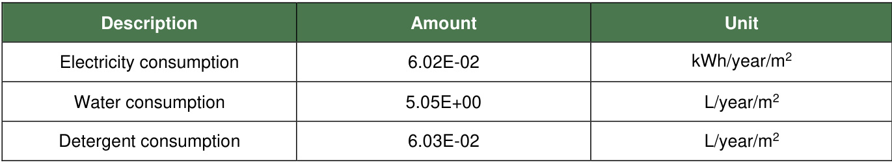

# Environmental Product  Declaration  

In accordance with ISO 21930:2017, ISO 14025:2006 and EN15804:2012+A2:2019/AC:2021  for:  

# Tapiflex Heterogenous vinyl Flooring  from  TARKETT  

EPD OF MULTIPLE PRODUCTS BASED ON WORST CASE RESULTS.  

#  

Programme:  Programme operator:   EPD registration number: Publication date:   Revision date  Valid until:  

The International $\mathsf{E P D^{\mathrm{\textregistered}}}$  System,  www.environdec.com  EPD International AB  S-P-01347  2018-12-01  2024-07-09  2029-07-09  

An EPD should provide current information and may be updated if conditions change. The stated  validity is therefore subject to the continued registration and publication at www.environdec.com  

# General information  

Programme information   
  

The EPD owner has the sole ownership, liability, and responsibility for the EPD.  

EPDs within the same product category but registered in different EPD programmes, or not compliant  with EN 15804, may not be comparable. For two EPDs to be comparable, they must be based on the  same PCR (including the same version number) or be based on fully-aligned PCRs or versions of PCRs;  cover products with identical functions, technical performances and use (e.g. identical  declared/functional units); have equivalent system boundaries and descriptions of data; apply equivalent  data quality requirements, methods of data collection, and allocation methods; apply identical cut-off  rules and impact assessment methods (including the same version of character is ation factors); have  equivalent content declarations; and be valid at the time of comparison. For further information about  comparability, see EN 15804 and ISO 14025.  This EPD is a specific EPD.  

# Company information  

Owner of the EPD:  Tarkett  

Contact: Myriam Tryjefaczka  ,  myriam.tryjefaczka@tarkett.com   Tarkett La Défense, 1 Terrasse Bellini  92400 Paris  

Description of the organisation:  

With an international coverage and a wide range of products, Tarkett has over 130 years of experience  in providing integrated solutions for floorings to professionals and end users.  

Many of the most important architectural firms in the world and building professionals have chosen  Tarkett for the value of its products and for its consultation and service abilities. Therefore, Tarkett  floorings and sport surfaces are present in several prestigious architectural reference points. Tarkett  offers integrated solutions for floorings, able to meet the particular needs of customers. Our wide range  of designs, colors and models provides an infinite series of possibilities, contributing to create a positive  environment and a better quality of life for people.  

Tarkett operates with the utmost respect for the environment towards the realization of eco-friendly  products.  

Tarkett’s commitment to the environment is woven throughout its business. Cradle-to-Cradle principles  are, in fact, the basis of the design and production of every solution. Particularly, the lifecycle analysis  is used to continuously improve the production process, and so the products until their use stage,  disposal and recycling. The commitment to the environment is also proven by the accession to the  Circular Economy 100 program, where Tarkett group, with a network of companies, is working to  develop a circular economy model based on the reuse of materials and preservation of natural  resources. The development of products that can be reused within internal production cycles, or external  ones in case of other individuals, has been an integral part of the business strategy aimed at  sustainability for many years. The WCM (World Class Manufacturing) management system has been  developed in 2009, and it includes the environmental pillar aimed to the elimination of losses and to the  growth of process efficiency.  

Product-related or management system-related certifications: ISO 9001, ISO 14001, ISO 50001, WCM  manufacturing site.  

Name and location of production site(s): Sedan (France), Clervaux (Luxembourg).  

# Product information  

Product name:   Tapiflex Excellence 17db, Tapiflex Excellence 19db, Tapiflex Platinium 100, Tapiflex  

Declared Product : Tapiflex Platinium 100 , results based on worst case scenario  Product identification: Heterogeneous poly (vinyl chloride) floor coverings (EN ISO 11638).     Product description: Tapiflex is a heterogeneous compact resilient floor covering developed by Tarkett.  The service lifetime recommended by Tarkett is 25 years.  Geography: European technology and process coverage.  

# LCA information  

Functional unit / declared unit:  $1\mathsf{m}^{2}$  of floor covering with a reference service life (RSL) of 1 year for  specified characteristics application and use areas according to ISO 11638 and EN ISO 10874.  Reference service life: 1 year.  

Time representative ness: 2023.  Database(s) and LCA software used: Ecoinvent3.9, Simapro 9.5  

Description of system boundaries: Cradle to grave and module D  $(\mathsf{A}+\mathsf{B}+\mathsf{C}+\mathsf{D})$   Cut-off criteria : The cut-off criteria used for this study follow the guidelines set out in the PCR which  conform to the EN 15804-A2, as following:  - All inputs and outputs to a (unit) process are included in the calculation where the data is available.  

- A maximum of $1\%$  of the total mass per unit process may be omitted. 

 - A maximum of $1\%$  of the total renewable and non-renewable energy for a unit process may be  omitted.  

- A maximum of $5\%$  of the total energy usage and mass per module may be omitted.  All input and output flows have been considered, including raw materials as per the product  composition provided by the manufacturer and packaging of raw materials as well as the final product.  Energy and water consumptions have also been considered at  $100\%$  according to the data provided.  

Mass balance approaches (MBAs), to claim, for example, biobased, renewable, and/or recycled  product content, are not applied.  

EN 15804 reference package” based on EF 3.1 has been used.  

# System diagram:  

  

More information: The product is classified in accordance with EN ISO 10874, EN 685, EN ISO 11638  and in reference to the FCSS (Floor Covering Standard Symbols) to be installed in various areas of  application, such as: healthcare, education, commercial, education. The area of use according to the  ISO 10874 is very heavy (34) for commercial classification and heavy (43) for industrial classification  

Modules declared, geographical scope, share of specific data (in GWP-GHG indicator) and data  variation:  

  

Content information  
  

According to PCR 2019:14 v1.3.3 , several sets of results, reflecting different products, are not allowed to be  declared in the same EPD. However, similar products from a single or several manufacturing sites covered by the  same PCR and manufactured by the same company with the same major steps in the core processes may be  grouped and thereby included in the same EPD;  The results of a worst case product Tapiflex Platinium 100 will be declared in this EPD.  

The variation in GWP-GHG results for modules A1-A3 between included products and the declared product goes  from  $3\cdot13\%$ .  

The components for Tapiflex Platinium 100   are detailed here :  

  

# Product manufacturing  

# Production process  

The following figures show the production process of heterogenous flooring :  

  

# Production waste  

  

NB: Post manufacturing recycling concerns the recycling of the losses inside the plant production.  Therefore, there is no end-of-life impact on losses (except the recycling preparation).  

# Electricity GWP-GHG  

  

# Health, safety and environmental aspects during production  

Tapiflex Platinium 100   production site complies with the ISO 14001 Environmental Management System  and the ISO 9001 Quality Management System.  

# Delivery and installation  

# Delivery  

The average distribution distance between the factory and the installation site is  $1240~\mathsf{k m}$ . It has been  calculated considering the average distance between European countries where Tarkett is selling the  Tapiflex Platinium 100   products and the factory plant in Sedan (France). The distribution is made by  truck.  

# Installation  

The different parts of the flooring are cut to fit the surface to fit the surface to be covered and they are  arranged together so that they can fit perfectly between them on the floor .The different parts of the  flooring are glued on the subfloor then they are welded together.  

  

# Waste  

During the installation approximately  $10\%$  of the flooring is lost as off-cuts. All flooring losses are sent  to recycling. Thanks to the ReStart program. Tarkett offers to all of its customer flooring installers a free  take-back system for installation off-cuts including equipment, logistics and recycling. This analysis  therefore considers a recycling scenario of the offcut.  

# Packaging  

$50\,\%$  of the packaging materials goes to incineration and $50\,\%$  goes to landfill  

# Use Stage  

# Reference Service Life (RSL)  

For this product, the stated RSL is 1 year. It should be noted, however, that the service life of a  Heteregenous polyvinyl chloride floor covering may vary depending on the amount and nature of floor  traffic and the type and frequency of maintenance. The manufacturer has provided this service life on  the basis of his experience of flooring manufacture and supply. This RSL is applicable as long as the  product use complies with that defined by ISO 14041 and ISO10874 in accordance with the product’s  classification.  The service lifetime recommended by Tarkett is 25 years .  

# Cleaning and maintenance  

Cleaning regime is based on traditional cleaning protocol integrating manual and mechanical  operations .  Depending on premises considered, these consumptions may vary. The considered  regime fits high traffic areas. The  maintenance scenario is :  

▪   Common maintenance : 2 times a week   ▪   Periodic maintenance : once every 2 weeks  ▪   Exceptionnal maintenance : 2 times a year  

  

# Prevention of structural damage  

To avoid excessive wear, usage should be restricted to the stated areas of application as outlined by  the norm ISO 10874.  

# End of Life  

Environmental impacts of landfilling are presented in module C. Tarkett also modeled an alternative  scenario, incineration. The results can be found under additional information  

# Landfilling /L  

Landfilling waste is still a proheminent waste management scenario. This option is however not  recommanded by Tarkett. Environmental impacts of landfilling are presented in module  $\mathbf{c}/\mathbf{l}$ .  

# Incineration with energy recovery /I  

Incineration with energy recovery is a rising waste management method in many of the countries in wich  Tapiflex Platinium 100   is sold. While Tarkett wishes to recycle  $100\%$  of products sold, incineration with  energy recovery is an alternative option if recycling is impossible. Environmental impacts of incineration  with energy recovery are presented in module  $\mathbf{c}/\vert$   under additional information.  

# Benefits and loads beyond system boundary  

# Landfilling /L  

Benefits accounted in this scenario exclusively come from installation offcuts recycling and are  presented in  D/L  

# Incineration with energy recovery /I  

Benefits from installation offcuts recycling and incineration energy recovery are calculated in  D/I  on page  17.  

# Results  

The estimated impact results are only relative statements, which do not  indicate the endpoints of the impact categories, exceeding threshold values,  safety margins and/or risks.  

Disclaimer :     The results of modules A1-A3  should not be used without  considering the results of module C.  

Environmental Information . Potential environmental impact  
  

Environmental Information . Potential environmental impact  
  

# Waste production and output flows  

Waste production  
  

Output flows  
  

Additional indicator  
  
1     GWP-GHG is the sum of GWP-Fossil and GWP-LULUC indicator  

# Variability of LCA results  

The declared environmental impacts are the impacts of the worst case product. The data was  collected for the two sites of production. The variability of the results was calculated by doing a  sensitivity analysis as recommended by the EN $15804{+}\mathsf{A}2/\mathsf{C}\mathsf{N}$ .  

Variation of environmental impacts for all indicators greater than  $10\%$  for A1-C modules  

  

# References  

General Programme Instructions of the International $\mathsf{E P D^{\mathrm{\textregistered}}}$  System. Version 4.0  

# Additional information – Potential impacts and flows in case of incineration.  

  