# Environmental Product  Declaration  

In accordance with ISO 14025:2006 and EN 15804:2012+A2:2019/AC:2021 for:  

# Asphalt mixtures SMA, AC V (surf), BBTM  and AC SAMI  

from  Vilnius asphalt plant of AB Eurovia Lietuva  

  

  

The International  $\mathsf{E P D^{\mathrm{\textregistered}}}$  System,  www.environdec.com  EPD International AB  EPD-IES-0014179  2024-07-10  2029-07-05  EPD of multiple products, based on average results of the product group.   An EPD should provide current information and may be updated if conditions change. The stated  validity is therefore subject to the continued registration and publication at www.environdec.com  

Programme:    Programme operator:   EPD registration number: Publication date:   Valid until:  

# General information  

Programme information   
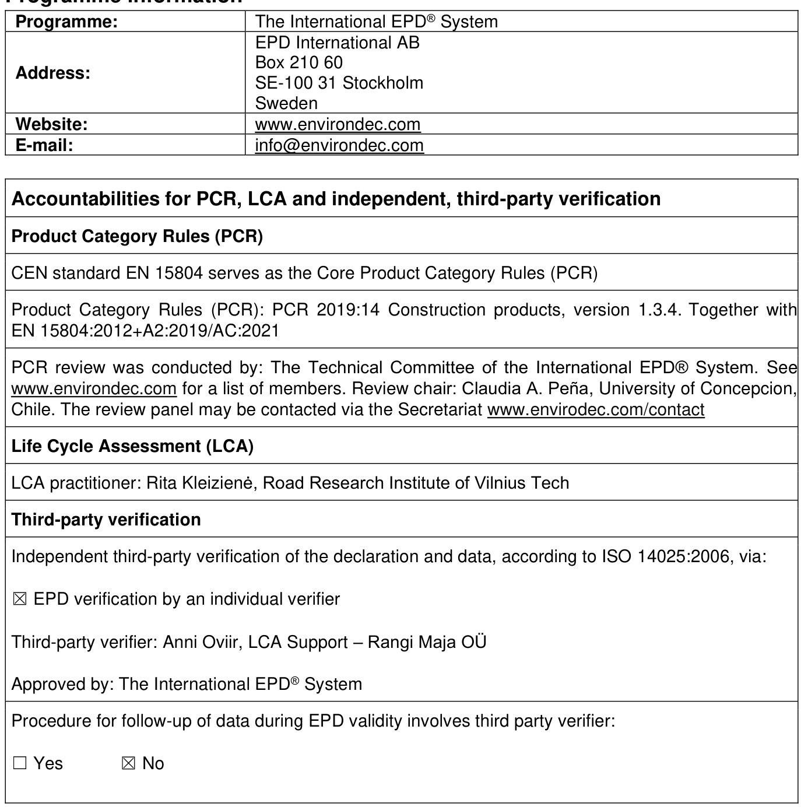  

The EPD owner has the sole ownership, liability, and responsibility for the EPD.  

EPDs within the same product category but registered in different EPD programmes, or not compliant  with EN 15804, may not be comparable. For two EPDs to be comparable, they must be based on the  same PCR (including the same version number) or be based on fully-aligned PCRs or versions of  PCRs; cover products with identical functions, technical performances and use (e.g. identical  declared/functional units); have equivalent system boundaries and descriptions of data; apply  equivalent data quality requirements, methods of data collection, and allocation methods; apply  identical cut-off rules and impact assessment methods (including the same version of character is ation  factors); have equivalent content declarations; and be valid at the time of comparison. For further  information about comparability, see EN 15804 and ISO 14025.  

The estimated impact results are only relative statements, which do not indicate the endpoints of the  impact categories, exceeding threshold values, safety margins and/or risks.  

# Company information  

Owner of the EPD: AB Eurovia Lietuva  

Contact: Technical and Environmental Manager Zigmantas Perveneckas  

Description of the organisation: Eurovia Lietuva is one of the oldest and largest road construction  companies in Lithuania. The company continues the decades-old traditions by applying the latest and  most advanced road construction technologies in the Vilnius and Klaipėda regions. AB Eurovia Lietuva  is a company that is specialized in the construction of roads and civil infrastructure. The company seeks  to protect the environment and people's well-being by playing a proactive role in road construction to  develop sustainable production of road materials.  

Product-related or management system-related certifications: AB Eurovia Lietuva is certified according  to ISO 9001, 14001, 45001, 50001.  

Name and location of production site(s): Vilnius asphalt plant production site is located in the Vilnius  suburb Riešė, about 6 km west-north of Vilnius.  

# Product information  

Product name:   Asphalt mixtures  Product identification:   
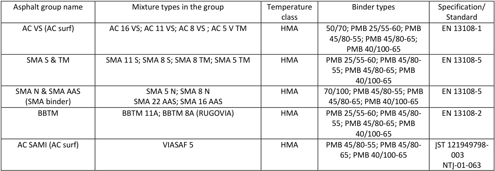  

Product description: Asphalt plant manufacture asphalt mixtures for a variety of different purposes,  ranging from highways, roads and city streets to industrial pavements. The asphalt mixtures that can be  produced at the declared plant are hot mix asphalt (HMA), warm mix asphalt (WMA), soft asphalt (SA)  and cold asphalt. The asphalt mixtures also are grouped by their application in the pavement. This plant  can manufacture the following asphalt mixture types: asphalt concrete (AC) for surface  $(\mathsf{V})$ , binder (A),  base (P) and surface-base (PD) layers, stone mastic asphalt (SMA), noise resistant (TM) and for traffic  loads - light (L), normal (N) and heavy (S). Mixtures can be produced with paving grade (PG) bitumen  or polymer-modified bitumen (PMB) and with reclaimed asphalt (RA) or without.  

The main components in asphalt mixtures are coarse and fine aggregates, filler and bitumen. Other  materials and additives are added to ensure the durability of the layers, their content varies depending  on the asphalt mixture type. These include cellulose fibre which normally constitutes  $0.3\%$  of mineral  aggregates' weight. Reclaimed asphalt is added to asphalt mixtures to replace virgin aggregates and  virgin bitumen.  

At the plant, the manufacture of asphalt mixture is managed from the on-site control room. Aggregates,  which are purchased and transported from external suppliers, are stored in open stockpiles of different  fractions (e.g. 2/5, 5/8, 8/11 etc.). Fine aggregates and RA are stored in covered stockpiles (e.g. 0/2,  RA etc.). The aggregates in an individual stockpile are hauled with a front loader to a cold feed bin of  the asphalt plant, then together with the other aggregate fractions of a given mix formulation (recipe)  are transported further by a conveyor belt running below the bins. The mixed aggregates enter a rotating  dryer drum, where the materials are dried and heated to the required temperature. The heated material  continues to an elevator and is further transported up to the batch tower. Then dry and hot aggregates  are screened and separated according to particle size and put into a weight hopper. The dry aggregates  are mixed with bitumen, filler, fibres and other additives in the mixing chamber. When a homogeneous  asphalt mixture is obtained and transferred with a skip hoist to an insulated storage silo before being  retrieved by a truck.  

The emissions (i.e. polyaromatic hydrocarbons, PAHs) generated in the dryer drum depend on  production temperatures, fuel type, amount and type of techniques used for adding RA. In this plant, RA  is added without preheating (cold feed) so PAHs content is minimal, all emissions created at the drying  drum or at the top of the batch tower are transported for filtering at the collector.  

UN CPC code: 15330  

Geographical scope: Lithuania  

Address of production site(s): Old Ukrmergės road 185 Kirzinės vs. Maišiagalos sen. LT-14247 Vilniaus  r.  

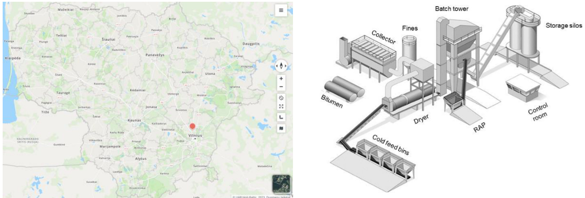  

Location of the AB Eurovia Lietuva asphalt  Schematic illustration of an asphalt plant  production facilities  

# LCA information  

Goal  

The goal of this is to declare the environmental impact for 1 tonne of asphalt mixtures produced in Vilnius  asphalt plant of AB Eurovia Lietuva based on the Product Category Rules. The result is used to  understand the environmental impact of the product up until the ”factory gate”. The information provided  in this declaration can be used to select asphalt mixtures during the design of engineering structures to  reduce environmental impact. The audience are construction and design companies and infrastructure  developers.  

# Declared unit  

1 metric tonne ( $\cdot1000\;{\sf k g})$  of manufactured asphalt mixture  

# Time representative ness  

The primary data collected are based on the required materials and energy to manufacture the product.  The primary data has been collected in the year 2022. Generic data is no older than 10 years and  specific data is no older than 5 years. LCI data for polymer-modified bitumen have been adapted from  the Australasian EPD Programme Ltd (2019). LCI data for bitumen is taken from Eurobitume (2021a)  has been supplemented with data from Ecoinvent (3.9.1), and information on polymer content has been  taken from mixture composition.  

The representative ness, completeness, reliability, and consistency are judged as good.  

# Database(s) and LCA software used:  

The life cycle assessment has been carried out using the software SimaPro 9.6. The database that  provided the inventory data was Ecoinvent version (3.9.1, Ecoinvent 3 – allocation, cut-off, EN 15804).  LCI data for bitumen was obtained from Eurobitume (2021a, 2021b). The selected potential  environmental impact categories comply with  EN 15804:2012+A2:2019/AC:2021 standard and are  aligned with the Environmental Footprint EF 3.1 method.  

# Electricity in manufacturing  

The Electricity in A3 accounts for less than $30\%$  of the total energy in A1- A3. The electricity provider  UAB “Ignitis”, which states that energy is produced from renewable resources, based on LCA data the  GWP-GHG indicator is 1.85 g CO2 eq./kWh.  

Description of system boundaries: Cradle to gate with modules C1–C4 and module D  $(\mathsf{A}1\!-\!\mathsf{A}3+\mathsf{C}+\mathsf{D})$ ;  

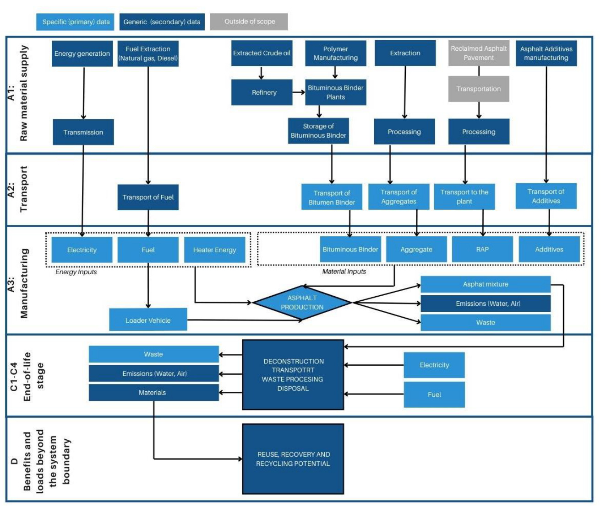  
System diagram:  

# Additional information:  

The key assumptions in the LCA are:  

•   Asphalt composition:  The asphalt composition of each product is taken from Vilniaus Asphalt  plant of AB “Eurovia Lietuva” systems. These data are considered to be of high accuracy.  •   Site energy data:  When calculating the environmental efficiency of individual asphalt mixtures,  the energy used for drying aggregates was calculated for individual asphalt mixtures according  to the production temperature, assigning annual energy consumption equally to all products (by  mass).  •   Other site-related impacts  (site electricity use, fuel use for front loader equipment) have been  attributed to asphalt products based on their respective production volumes (in tonnes). This  approach assumes that the impacts are similar per tonne of asphalt product. Mass allocation is  considered the most reasonable approach to attributing generic site-related environmental  impacts to different products.  •   Road transports are assumed to be carried out by EURO 5 standard vehicles.  •   The polymer-modified bitumen  is set to Styrene-Butadiene-Styrene SBS.   •   Asphalt mixtures is  $100\,\%$  recyclable , in calculations for module D the recycling rate is set to  $90\%$  of reuse to produce a new asphalt mixture and $10\%$  recycling to unbound base layers. This  is based on specific data provided by ”Eurovia Lietuva” representatives. The assumption is  considered reasonable as the industry strives to recycle as much asphalt as possible due to  

both economical and environmental benefits. This end-of-life scenario is representative as one  of the most probable alternatives.  •   Asphalt mixture grouping.  The average results in the group have been obtained by modelling  each asphalt mixture to determine their environmental impact, and then the average  environmental impact per group has been determined and declared.  

# Cut-off rules:  

In relation to EN  $15804{:}2012{+}\mathsf{A}2{:}2019/\mathsf{A C}{:}2021$ , the cut-off criteria for input and output exclusion for  the insufficient input data or data gaps for the asphalt mixture manufacturing process, is  $1\%$  of the total  primary energy usage and  $1\%$  of the total mass input of the process. The total of sum of neglected input  flows is not exceed  $5\%$  of energy usage and mass per stage (A1-A3, C1-C4 and D). The following cut- offs have been made:  

•   The packaging for the input materials used in the production process are negligible.  •   Lubricants and pigments used in asphalt plant production are negligible;  •   Water is not used in the asphalt plant production;  •   Asphalt mixtures as products have been grouped based on mass allocation of raw materials.  

# Validation of the data:  

Primary data collection by the manufacturer are based on the required materials and energy to  manufacture the asphalt product. The data of the raw materials are collected per declared unit (1 tonne).  All necessary life cycle inventories for the basic materials are available in the database or EPDs. No  generic selected datasets (secondary data) used are older than ten years. No specific data collected is  older than five years and represent a period of one year. The representative ness, completeness,  reliability and consistency are judged as good.  

# Product end of the life  

The EPD details information about the scenarios taken into account, based on these guidelines or on  specific scenarios defined by the company to represent the certified product at the downstream stage.  All scenarios used in this study are plausible.  

In the demolition phase the asphalt is removed by cold milling. It was calculated that the energy  consumption of a demolition process for asphalt is on average 0.32 liters of diesel per tonne of asphalt  (C1). It is estimated that there is no mass loss during the use of the product, therefore the end-of-life  product is assumed that it has the same weight as the decreased product. Transportation distance to  the waste treatment facility, which is located in the asphalt plant, is estimated $50\,\mathsf{k m}$  by transporting with  EURO5 type lorry (C2). At the waste treatment facility, milled asphalt is recycled and diverted for further  use. Two scenarios have been analysed: (1) when  $100\%$  of crushed asphalt pavement is reused, and  (2) when  $90\%$  of reclaimed asphalt is reused to produce new asphalt mixtures and  $10~\%$  of RAP is  recycled and used for unbound road layers. Scenario 2 included in the following study is representative  as one of the most probable alternatives.  

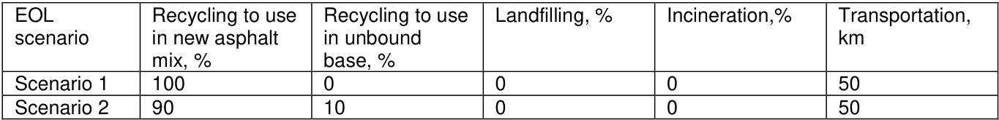  

Modules declared, geographical scope, share of specific data and data variation:   
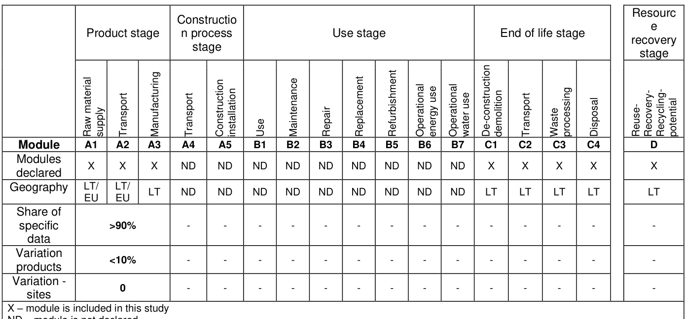  

# Content information  

The content of declared asphalt mixtures is presented in table below. The asphalt mixtures have been  grouped based on the average mass of materials for determination of the impact categories.   In the table,  the composition of the asphalt mixture is presented in percentages and intervals depending on the type  of mixtures, as this is a company secret.  

The packaging of asphalt mixtures is negligible since after mixing the loose mixture is poured straight to  the trailer.  

The products do not contain any substances of very high concern (SVHC) according to REACH.  

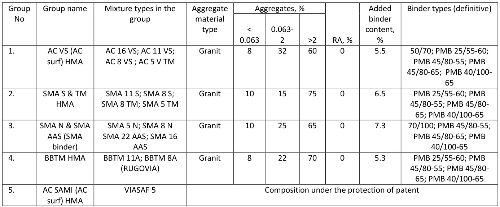  

# Results 1  of the environmental performance indicators  

Mandatory impact category indicators according to EN  $\pmb{15804+A2}$ , EF 3.1  
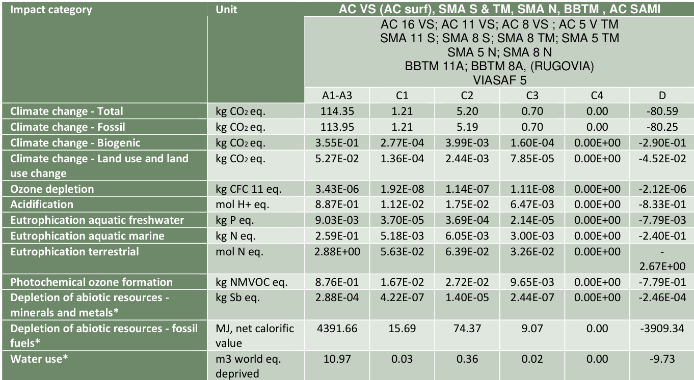  
\* The results of this environmental impact indicator shall be used with care as the uncertainties on these results are high or as  there is limited experienced with the indicator.  

Environmental impact indicator GWP-GHG   
  

Additional environmental impact indicators according to EN  $\pmb{15804+\pmb{\Delta}2}$ , EF 3.1  
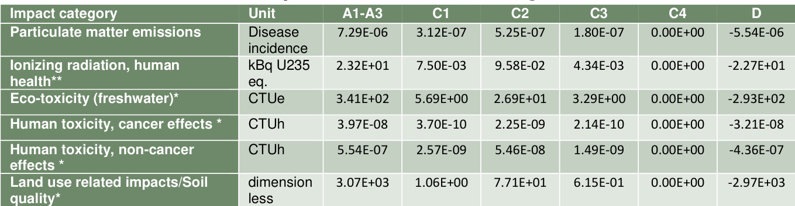  
\*The results of this environmental impact indicator shall be used with care as the uncertainties on these results are high or as  there is limited experienced with the indicator.  \*\*This impact category deals mainly with the eventual impact of low dose ionizing radiation on human health of the nuclear fuel  cycle. It does not consider effects due to possible nuclear accidents, occupational exposure nor due to radioactive waste disposal  in underground facilities. Potential ionizing radiation from the soil, from radon and from some construction materials is also not  measured by this indicator  

Resource use indicators per functional unit 
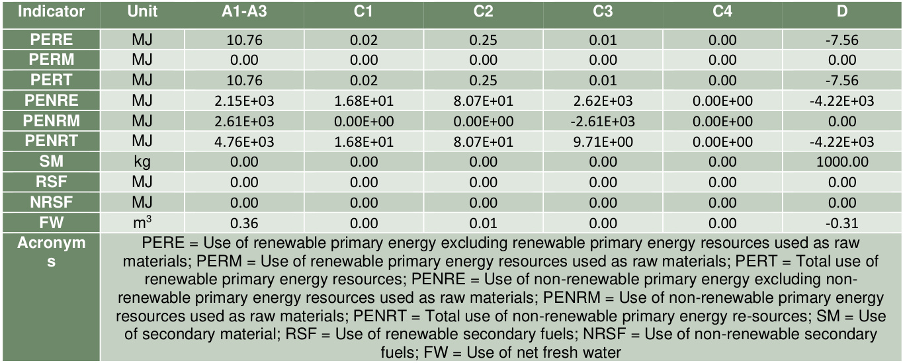  

# Waste indicators  

Final waste and output flows, refers to flows that are leaving the system of the LCA. In this LCA only  elementary flows (substances) are leaving the system. For the manufacturing, there are no such flows  for any type of asphalt. All waste equals zero due to the use of ecoinvent as the database, which already  accounts for the waste in the datasets.  

# Output flow indicators  

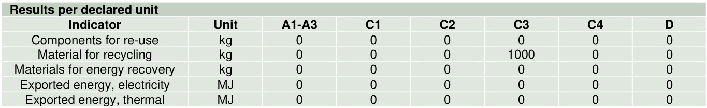  

# Other environmental performance indicators  

In accordance with EN  $15804{+}\mathsf{A}2$ , the biogenic carbon content of asphalt mixtures containing cellulose  has not been calculated due to the fact that the amount is less than  $5\;\%$  of the total mass of the final  product.  

# Additional environmental information  

Reclaimed asphalt is used in several of the declared asphalt mixtures, which contributes to a reduced  use of virgin raw materials. With the mixing of reclaimed asphalt, not only does the amount of aggregate  decrease, but also the amount of added binder decreases.  

# Differences versus previous versions  

There are no previous versions of this EPD.  

# References  

Kleizienė, R. (2024). LCA Report, Road Research Institute of Vilnius TECT.  

Eurobitume. (2021a). 2021 update to the Eurobitume Life-Cycle Inventory For Bitumen (Version 3.1).  Eurobitume  

https://www.eurobitume.eu/fileadmin/Feature/LCI/EUB2975.001 LC I Update 2020 01 LR pag  es.pdf  

Eurobitume. (2021b). Life Cycle Inventory 2021 update, without Infrastructure - Bitumen [Excelfil].  Eurobitume  

The Australasian EPD Programme Ltd (2019). Appendix to product category rules for asphalt mixtures  – Australia.  

EN 15804:2012 $^+$ A2:2020 Sustainability of construction works – Environmental product declarations –  Core rules for product category of construction products  

EN ISO 14025:2010 Environmental labels and declarations – Type III environmental declarations –  Principles and procedures  

ISO 14040:2006: Environmental management - Life cycle assessment — Principles and framework   ISO 14044:2006: Environmental management — Life cycle assessment — Requirements and  guidelines  

EN 15643-5:2017: Sustainability of construction works - Sustainability assessment of buildings and  civil engineering works - Part 5: Framework on specific principles and requirement for civil engineering  works $->$  parallel standard  

ISO/FDIS 21931-2:2018 Sustainability in buildings and civil engineering works -Framework for  methods of assessment of the sustainability performance of construction works - Part 2: Civil  engineering works.  

Product category rules (PCR) (2024) Construction products PCR 2019:14, Version 1.3.4 Valid until  2025-06-20  