# Environmental Product  Declaration  

In accordance with ISO 14025:2006 and EN 15804:2012+A2:2019/AC:2021, for:  

# Diamond Series  

from  NINGBO HELONG NEW MATERIAL CO., LTD  

  

Programme:  Programme operator:   EPD registration number:  Publication date:   Valid until:  

The International  $\mathsf{E P D^{\mathrm{\textregistered}}}$  System,  www.environdec.com  EPD International AB  EPD-IES-0015630  2024-07-24  2029-07-23  

An EPD should provide current information and may be updated if conditions change. The stated  validity is therefore subject to the continued registration and publication at www.environdec.com  

# General information  

Programme information   
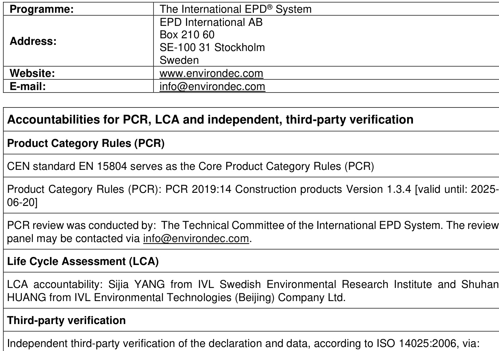  

☒  EPD verification by individual verifier  

Third-party verifier: Matthew Fishwick from Fishwick Environmental Ltd.  

  

Approved by: The International $\mathsf{E P D^{\mathrm{\textregistered}}}$  System  

Procedure for follow-up of data during EPD validity involves third party verifier: 

 ☐  Yes  ☒  No  

[Procedure for follow-up the validity of the EPD is at minimum required once a year with the aim of  confirming whether the information in the EPD remains valid or if the EPD needs to be updated during  its validity period. The follow-up can be organized entirely by the EPD owner or together with the original  verifier via an agreement between the two parties. In both approaches, the EPD owner is responsible  for the procedure being carried out. If a change that requires an update is identified, the EPD shall be  re-verified by a verifier]  

The EPD owner has the sole ownership, liability, and responsibility for the EPD.  

EPDs within the same product category but registered in different EPD programmes, or not compliant  with EN 15804, may not be comparable. For two EPDs to be comparable, they must be based on the  same PCR (including the same version number) or be based on fully-aligned PCRs or versions of PCRs;  

cover products with identical functions, technical performances and use (e.g. identical  declared/functional units); have equivalent system boundaries and descriptions of data; apply equivalent  data quality requirements, methods of data collection, and allocation methods; apply identical cut-off  rules and impact assessment methods (including the same version of character is ation factors); have  equivalent content declarations; and be valid at the time of comparison. For further information about  comparability, see EN 15804 and ISO 14025.  

It is discouraged to use of the results of modules A1-A3 without considering the results of module C.  

# Company information  

Owner of the EPD: NINGBO HELONG NEW MATERIAL CO., LTD  

Contact: Yun ZHOU ( $\cdot{}^{+86}$  138 5832 8002)  

Website: yardcom.net  

Description of the organisation:  

Ningbo Helong New Materials Co., Ltd. was established in May 2011. It is a green and high-tech  enterprise specialising in the research and development of plastic wood decking, plastic wood siding,  plastic wood decorative materials and landscape materials.  

The first phase of the factory covers an area of more than 100 acres, with nearly 30 high-strength quality  plastic wood composite material production lines, and the current annual capacity of 50,000 tons. The  company adheres "He" culture as the core, always putting people first, being humble, innovative quality,  restoring nature, and benefiting mankind for the mission, focus on the creation of quality new wood  materials. Building a new economy of circular ecology. The new generation of high-quality wood-plastic  decking, wood-plastic wallboard, wood-plastic gallery frames, wood-plastic fences, wood-plastic flower  boxes and other products developed by the company, embodies the core technology of Helong people’s  ingenuity and innovation for many years, and completes the revolutionary reshaping and upgrading of  wood-plastic composite new materials. More than a dozen performance test indicators in the industry  are internationally advanced, defining the next generation of high-quality wood-plastic standards. At the  same time, the wood-plastic landscape of Helong all over the world has become a new natural landmark  of many public scenic spots. The company’s innovative research and development of high-end co- extruded wood plastic products with double-sided matte imitation wood effect is the world’s first, has  been widely recognised in the world, and sold in more than 30 countries. The product has been able to  compete with the United States of the world’s top brand similar products and some of the core indicators  are world’s leading. After years of research and development, through advanced unique technology, the  production of products with high strength and hardness can replace the use of preserved wood and  natural wood.  

# Product-related or management system-related certifications:  

# For products:  

The product follows the standards and/or certificates of GB/T 24508-2020 “Wood-plastic composite  flooring”, EN 15534-1:2014+A1 “2017 Composites made from cellulose-based materials and  thermoplastics (usually called wood-polymer composites (WPC) or natural fibre composites (NFC) Part  1: “Test methods for character is ation of compounds and products”, GB/T 35612-2017 “Green product  assessment. Wood plastic composites products”, and ASTM F 1838-19 “Standard Performance  Requirements for Adult and Children's Plastic Chairs for Outdoor Use”.  

# For management system:  

Helong company has the management system-related certifications including ISO 9001 - Quality  Management System, ISO 14001 – Environmental Management System, ISO 45001 - Occupational  Health and Safety Management Systems, Chain of Custody Certification of Forest Stewardship Council,  Global Recycled Standard, WWF Low Carbon Manufacturing Programme.  

# Name and location of production site:  

# Product information  

Product name:   Diamond Series  

# Product description:  

The product is a kind of aluminium plastic product, consisting of aluminium alloy profile as the main  "core layer" material, modified HDPE as the main "exterior cladding layer" material, and through the  modification technology of the functional surface layer and the development of special adhesives, it  achieves the plastic clad metal profile with high weather resistance, high strength and high adhesion.  The product is a polymer material cladding on the surface of aluminium alloy, which not only achieves  superior thermal insulation effect, but also solves the bottleneck of aluminium alloy in the door and  window filling thermal insulation, or the need for partition processing, etc., and also greatly enhances  the service life of aluminium alloy, and its product life can reach more than 25 years. The outer surface  layer of the product is the independently developed high weather-resistant functional polymer wood-like  material layer, which breaks through from the field of wood-plastic to the field of metal materials, and  makes the application end of the material technology break through the limitations of the wood-plastic  single industry. The density of the product is  $2.00\ {\mathsf{g}}/{\mathsf{c m}}^{3}$ . The performance of the product is shown in  the table below.  

Table 1. Product performance of the Diamond Series product  
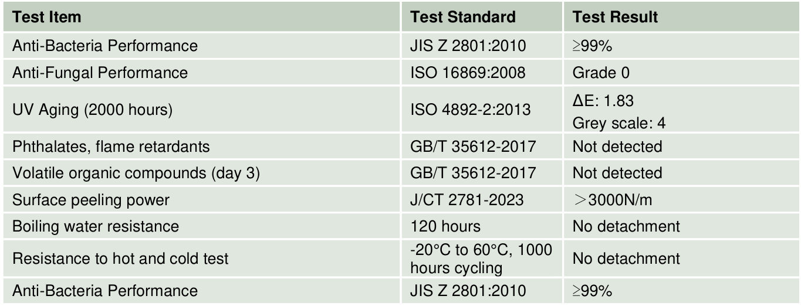  

UN CPC code:   392  

# Geographical scope:  

Modules A1-A3 represent production of the products in China. Module A4 and A5 represent the shipping  and construction from China to all over the world. Module B, C, and D represent the use and end-of-life  treatment with benefits out of the system boundary of the products worldwide.  

# LCA information  

Declared unit:   1 tonne of the studied product  

Reference service life:  25 years  

# Time representative ness:   2023 (January to December).  

Database(s) and LCA software used:   Managed LCA Content 2023.2 Databases and ecoinvent 3.9.1 (cut-off), LCA for Experts (Gabi)  

# Description of system boundaries:  

The scope of the EPD generated corresponds to “cradle to gate with options” which serves type (b) EPD,  assessing the potential environmental impacts associated with the studied product. The information  module included in the study is A1-A3, A4-A5, B1-B7, C1-C4, and D, no processes are omitted or  excluded in this study.  

# System diagram:  

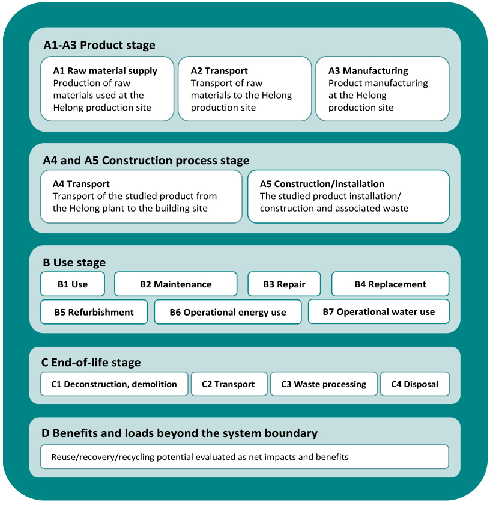  

# Manufacturing processes:  

As the manufacturing process is important to understand the whole studied system, the description of  the main manufacturing processes for producing the studied product is explained as below. A flow chart  of product manufacturing is shown below.  

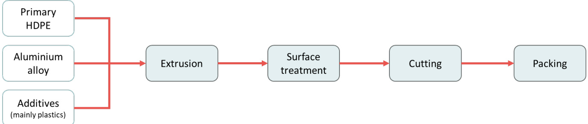  
Figure 1 The main production process of studied product.  

Diamond series product is made of aluminium alloy profiles and modified HDPE as the main materials,  and the HDPE-based polymer material is externally wrapped on the surface of aluminium alloy using  high bonding adhesive. After the extrusion process for all products, then is the surface treatment and  cutting process to make the finished product and sent to packaging process.  

The GWP-GHG of electricity mix for Zhejiang province in this study is 0.807 kg CO 2  eq./kWh. Note that  the Guarantees of Origin market in China represents an extremely small proportion of production and  consumption, and therefore the consumption mix is effectively the same as the residual mix.  

Table 2. Electricity structure of the Zhejiang province and the dataset chosen for it  
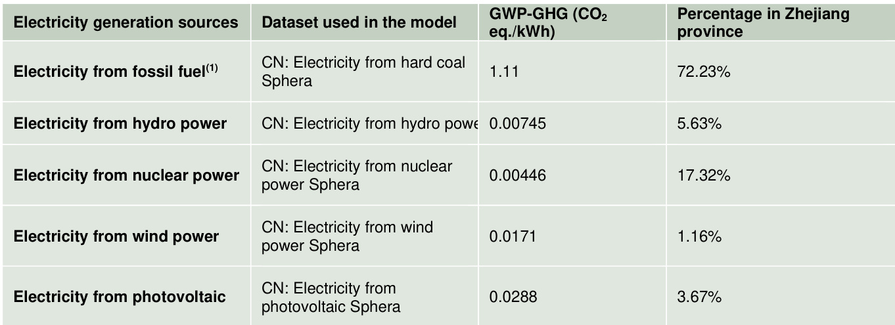  

(1)  In the 2022 China Electricity Yearbook, the percentage of electricity from fossil fuel for each province is not specified.  A brief description of electricity from fossil fuel for the whole country is given in the yearbook, i.e. it covers coal, gas,  oil, biomass, and a small amount of unidentified sources for generating electricity. Based on the information in the  yearbook, i.e., electricity from hard coal accounts for more than  $80\%$  of the thermal power generation types, and  considering that China is a country where coal-fired power generation is the main source of thermal power generation,  the LCA practitioner (IVL) decide to use electricity from hard coal as  $100\%$  of the dataset selection for electricity from  fossil fuel in this study for modelling.  

# More information:  

Scenarios and additional technical information:  

   The product is manufactured in China, and the waste treatment of the waste generated during the  manufacturing process was included in the system boundary.  

   The product is sent to and used globally. For module A4, the longest shipping distance is applied  for the model as the conservative consideration, which is selling to the United States. The specific  data of the longest transportation information from the manufacturing plants to the overseas selling  destination is collected by the client, which is the specific data.  

   With regard to module A5, during the construction stage, the product requires some screws, which  are included in the study. The energy consumption of the construction, i.e., electricity, is included  in the study. Besides, according to the information provided by the client, the packaging of the  studied products is assumed to become to waste in this stage and is treated to end-of-life stage.    

    In module B, the product in this study do not generate emissions and consume energy and water  during the whole use phase, so the use phase environmental impact is deemed to be zero.  

   The modelling of module C1 is assumed that the consumption of additional materials and energy  used in the deconstruction stage for installation is zero. The  ${\mathcal{2}}4\%$  of the rest of the waste product  would be sent to C4 for disposal, and $76\%$  to material recycle according to the recycling data from  the International Aluminium Institute. For module C2, conservative assumptions have been made  that the waste product would be transported for $500\,{\mathsf{k m}}$  by truck. For the waste processing module  C3, disposal module C4, and module D (benefits and loads beyond the system boundary), the  generic data has been applied. Besides, it is assumed the waste products would be processed in  C3 with a $3.01\%$  mass loss.  

   Regarding the module D calculation, it should be noted that the product does not have post- consumer materials as the raw material. Meanwhile, this study does not consider the co-product  allocation in this project, so there is no co-product allocation issue for the module D calculation.  

# Allocation:  

Allocation rules for co-products are mentioned in the PCR. In this study, there are no co-products  produced. No co-product allocation has been applied in this study i.e. all burdens are allocated to the  final studied product. For the allocation of waste and module D calculation, this study strictly follows the  PCR.  

# Cut-off rules:  

The cut-off criteria established by the PCR is that data for elementary flows to and from the product  system contributing to a minimum of  $95\%$  of the declared environmental impacts shall be included (not  including processes that are explicitly outside the system boundary).  

This study strictly follows the cut-off rule. Raw materials with high environmental impacts were reserved  in calculation even though their mass is smaller than $5\%$  of the whole product. The cut-off rule is only  applied on auxiliary materials of the studied product. The total amount of cut-off materials in the product  system is fully below  $1\%$  and no high emission material is used for those materials. Besides, the  transportation of A3 manufacturing waste which are sent third-party for treatment is cut-off. The  sensitivity analysis is applied on the cut-off part to ensure the environmental impact of the cut-off part is  below $5\%$ .  

Modules declared, geographical scope, share of specific data (in GWP-GHG results) and data  variation (in GWP-GHG results):  

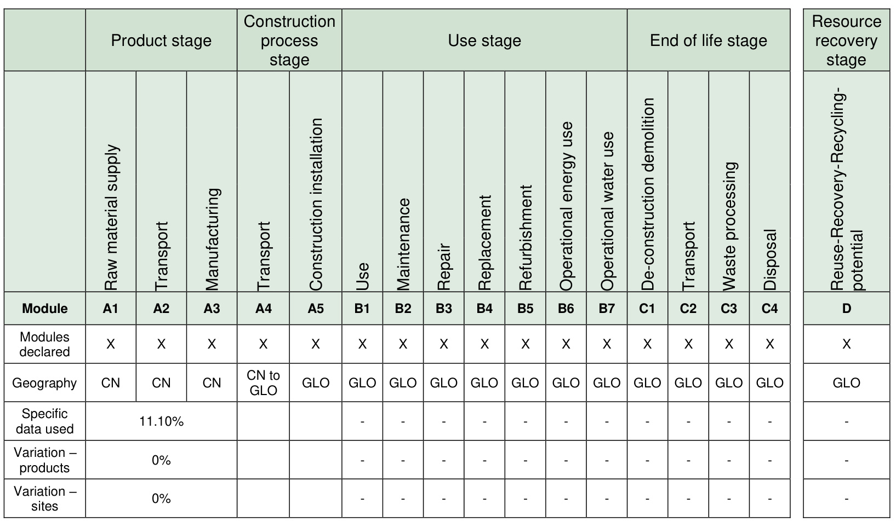  
(1) Modules included in the EPD (X) and the modules not declared (ND).  

Content information  
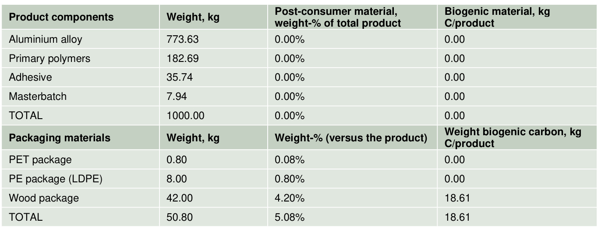  

At the time of data collection, no substance included in the Candidate List of Substances of Very High  Concern (SVHC) for authorization under the REACH Regulations is present in the products covered by  this LCA and EPD either above the threshold for registration with the European Chemicals Agency or  above $0.1\%$  (wt/wt).  

Depending on the PCR, in general, the production and end-of-life processes of infrastructure or capital  goods used in the product system should be excluded, unless there is evidence that they are relevant  in terms of their environmental impact, or when a generic LCI dataset includes infrastructure/capital  goods, and it is not possible, within reasonable effort, to subtract the data on infrastructure/capital goods  from this dataset (directly citation from section 4.3.2 of PCR 1.3.4). In this study, the infrastructure and  capital goods are not included in the LCA analysis since they are used plenty of times for several years  for the product manufacturing. According to the PCR, it should be excluded.  

All results in this LCA analysis are calculated by the EN  $15804{+}\mathsf{A}2$ .  The “EN 15804 reference package”  is calculated based on EF 3.1.  

# Results of the environmental performance indicators  

The estimated impact results are only relative statements which do not indicate the end points of the  impact categories, exceeding threshold values, safety margins or risks.  

All results are calculated on the declared unit, which is 1 tonne of the studied product in this study.  

Mandatory impact category indicators according to EN 15804  Results per tonne of Diamond Series  
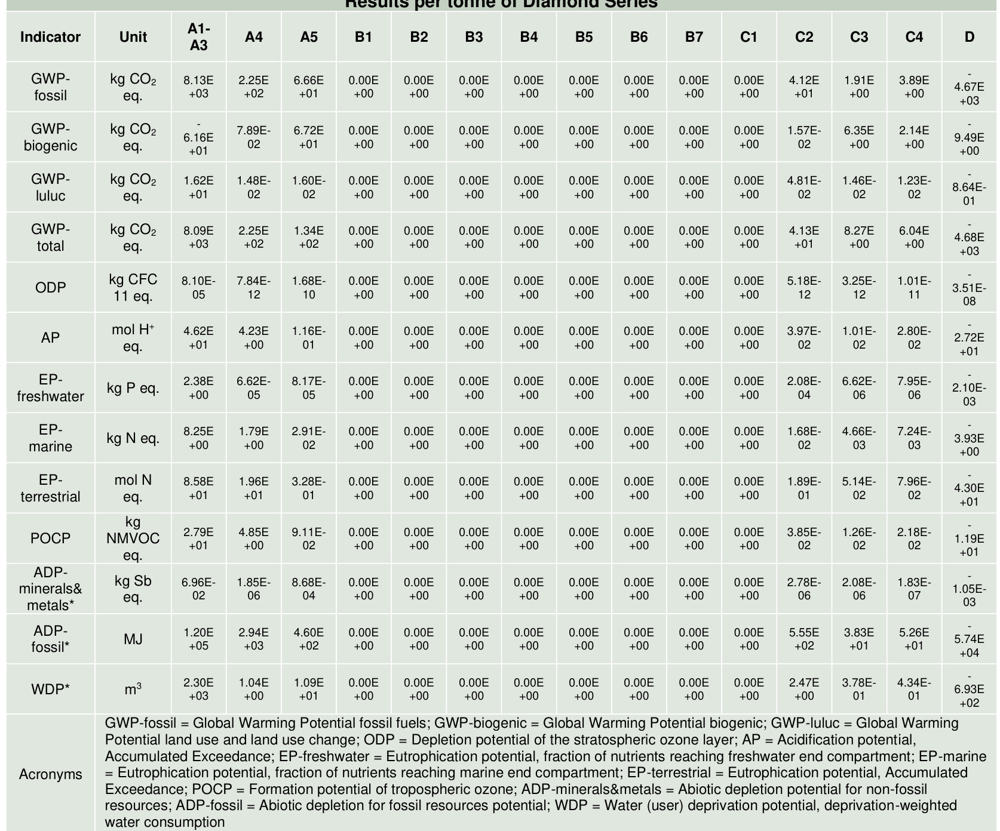  

Additional mandatory and voluntary impact category indicators  
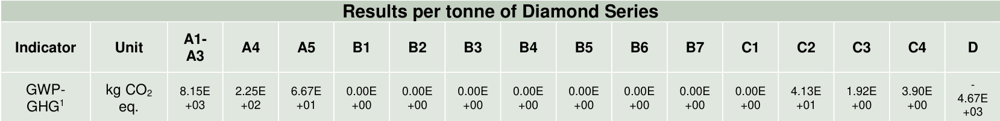  

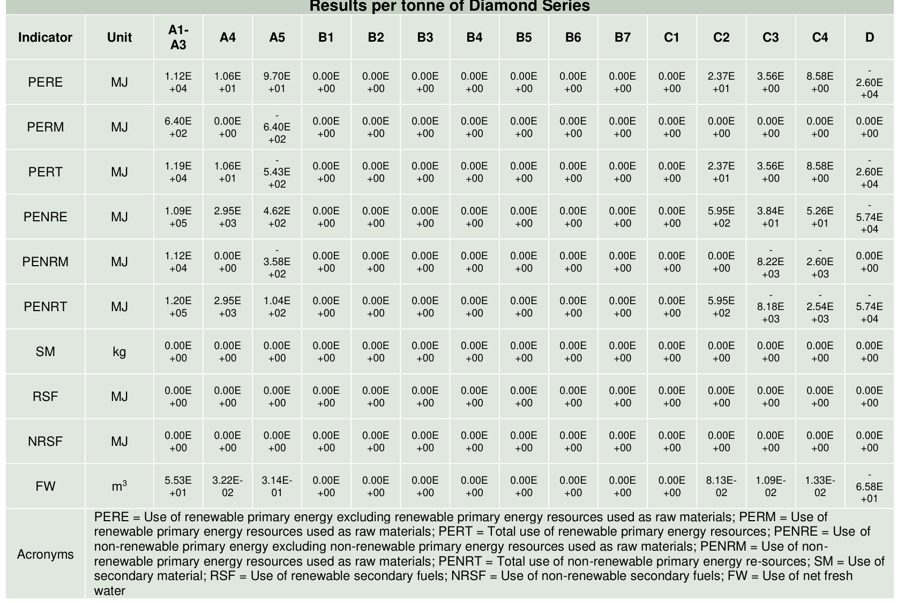  

Waste indicators  
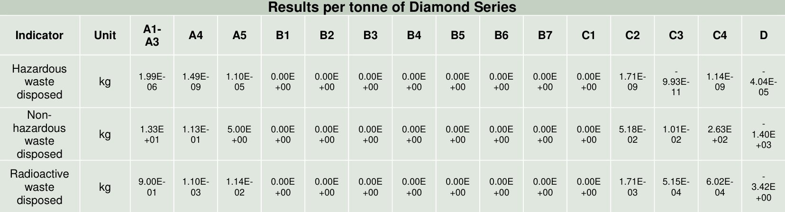  

# Output flow indicators  

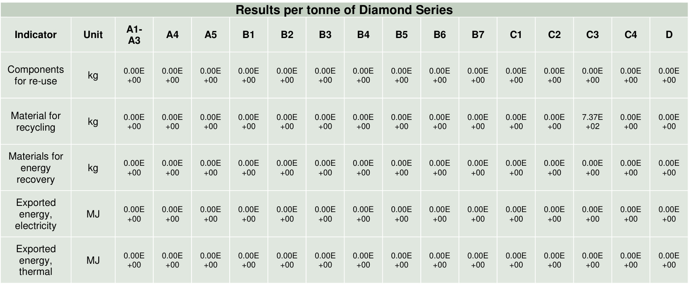  

# References  

Emami, N., Heinonen, J., Marteinsson, B., Säynäjoki, A., Junnonen, J.-M., Laine, J., & Junnila, S.  (2019). A Life Cycle Assessment of Two Residential Buildings Using Two Different LCA Database- Software Combinations: Recognizing Uniformities and Inconsistencies. Buildings, 9(1), 20.  https://doi.org/10.3390/buildings 9010020  

European Committee for Standardization (2021), EN 15804:2012+A2:2019/AC:2021, Sustainability of  construction works - Environmental Product Declarations - Corerules for the product category of  construction products  

Global Guidance Principles for LCA databases. A basis for greener processes and products, ‘Shonan  Guidance Principles’, 2011; ISBN: 978-92-807-3174-3.  

GPI (2021), General Programme Instructions for the International EPD System version 4.0.  

International Aluminium Institute (2020). Aluminium Recycling Factsheet. https://international- aluminium.org/resource/aluminium-recycling-fact-sheet/  

ISO (2006a). ISO 14025:2006, Environmental labels and declarations – Type III environmental  declarations – Principles and procedures.  

ISO (2006b). ISO 14040:2006, Environmental management – Life cycle assessment – Principles and  framework.  

ISO (2006c). ISO 14044: 2006, Environmental management – Life cycle assessment – Requirements  and guidelines.  

Kalverkamp, M., Helmers, E., & Pehlken, A. (2020). Impacts of life cycle inventory databases on life  cycle assessments: A review by means of a drivetrain case study. Journal of Cleaner Production, 269,  121329. https://doi.org/10.1016/j.jclepro.2020.121329  

LCA database published by the ecoinvent association originally known as the ecoinvent Centre, the  Swiss Centre for Life Cycle Inventories. Since June 2013 ecoinvent is a not-for-profit association  founded by institutes of the ETH Domain and the Swiss Federal Offices. The version 3.9.1 was used.  

LCA for Expert software. The former name of the software is Gabi. The software version 10.7, CUP  2023.2 version is used.  

Managed LCA Content 2023.2 Databases (Gabi database) provided by Sphera.  

Pauer, E., Wohner, B., & Tacker, M. (2020). The Influence of Database Selection on Environmental  Impact Results. Life Cycle Assessment of Packaging Using GaBi, Ecoinvent 3.6, and the  Environmental Footprint Database. Sustainability, 12(23), 9948. https://doi.org/10.3390/su12239948  

PCR Construction, PCR 2019:14, Version 1.3.4, Valid until 2025-06-20  

United States Environmental Protection Agency (2023). Plastics: Material-Specific Data.  https://www.epa.gov/facts-and-figures-about-materials-waste-and-recycling/plastics-material-specific- data  

United States Environmental Protection Agency (2023). Wood: Material-Specific Data.  https://www.epa.gov/facts-and-figures-about-materials-waste-and-recycling/wood-material-specific- data  