# EPD   - DICHIARAZIONE AMBIENTALE DI PRODOTTO  

Calcestruzzi dell’impianto di Taurisano (LE)- Colabeton S.p.A.  CLS Rck40 S4 XC2 D25 CEM IV/A 42,5 R - SR CAM  

  

  

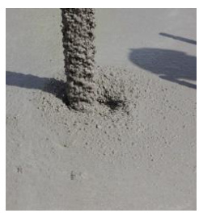  

The International EPD® System, www.environdec.com  EPD International AB  EPD-IES-0015800  29/07/2024      28/07/2029    ISO 14025 ;  EN 15804:2012+A2:2019/ AC:2021  

# Programme  

Programme operator   Numero di registrazione EPD  Data di pubblicazione  Data di validità  In accordo con  

Informazioni sul programma   
  

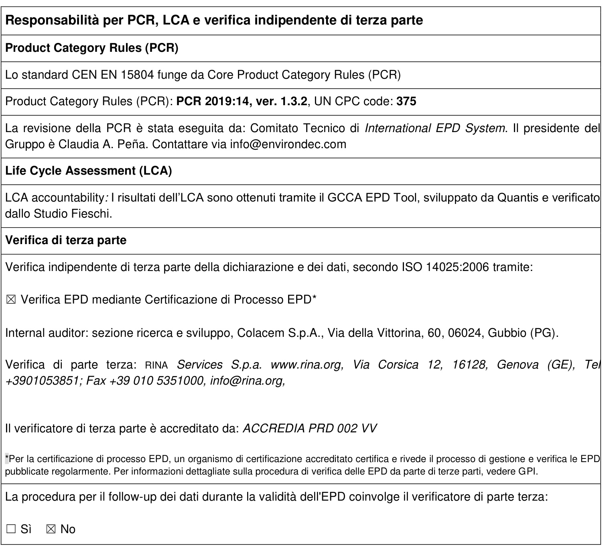  

Il proprietario dell'EPD ha la proprietà e la responsabilità esclusiva dell'EPD.  

Affinché due EPD siano comparabili, devono essere basate sulla stessa PCR (compreso lo stesso numero di versione) o essere basate su  PCR o versioni di PCR completamente allineate; coprire prodotti con funzioni, prestazioni tecniche e uso identici (ad esempio identiche  unità dichiarate/funzionali); avere limiti di sistema e descrizioni dei dati equivalenti; applicare requisiti equivalenti in materia di qualità  dei dati,  metodi di raccolta dei dati e metodi di assegnazione; applicare norme di esclusione e metodi di valutazione d'impatto identici  (compresa la stessa versione dei fattori di caratterizzazione); avere dichiarazioni di contenuto equivalente; ed essere valido al momento  del confronto. Per ulteriori informazioni sulla comparabilità, vedere EN 15804 e ISO 14025.  

# REVISIONI  

  

# L’AZIENDA  

Proprietario dell’EPD : Colabeton S.p.A .  (  

Contatti: Giuseppe Marino Nardelli,  gm.nardelli@financo.it  

  

Descrizione dell’organizzazione: Colabeton è una società del Gruppo Financo, controllato dalle famiglie  Colaiacovo, che produce e distribuisce calcestruzzo preconfezionato dal 1987. La Direzione Generale ha sede a  Gubbio (PG). L’azienda si è attestata da tempo a terzo  produttore italiano nel settore, grazie a una rete  distributiva estesa su gran parte del territorio nazionale.  L’orientamento improntato alla sostenibilità è perseguito  attraverso un know-how organizzativo e tecnologico di  rilievo, nella gestione degli impianti e nella continua  ricerca e sviluppo di prodotti innovativi. Il patrimonio di  conoscenze di Colabeton è incentrato su obiettivi  industriali in cui al centro vi è comunque la Persona. Lo  sviluppo economico va di pari passo con il rispetto per  l’ambiente, grazie a una corretta gestione delle risorse  naturali e a un rapporto con le comunità locali attivo e  responsabile.  

La sicurezza garantita dall’assoluta trasparenza dei  controlli, la competenza del personale, oltre alle soluzioni  tecnologiche d’avanguardia fanno di Colabeton uno dei  leader più affidabili nella produzione di calcestruzzo in  Italia ( https://www.colabeton.it/azienda/company-profile ).  

  
Figura 1. Colabeton S.p.a.  

Certificazioni relative ai prodotti o alla gestione del sistema: UNI EN ISO 9001; UNI EN ISO 14001  

# I PRODOTTI  

Nome dei prodotti:  

# CLS Rck40 S4 XC2 D25 CEM IV/A 42,5 R - SR CAM  

Identificazione dei prodotti: Calcestruzzi preconfezionati conformi alla  UNI   EN 206  

Descrizione del prodotto: L’utilizzo tipico di questi prodotti è in qualità di “calcestruzzo strutturale per opere edili  civili”. Il calcestruzzo viene prodotto miscelando cemento, aggregati (sabbia, pietrisco e ghiaia) acqua e additivi.  La sezione cemento è composta da sili di stoccaggio collegati ad una pesa, l’estrazione ed il caricamento del  cemento in autobetoniera avviene tramite delle coclee chiuse. Il sistema di aspirazione e filtri garantisce  l’abbattimento delle polveri durante il carico delle autobetoniere. Il cemento  CEM IV/A (V) 42,5 R - SR/IAS  utilizzato  per la produzione del calcestruzzo oggetto della presente EPD è prodotto presso lo stabilimento  Colacem S.p.A. di  Galatina  (prestazioni ambientali in  S-P-09114).  L’aggregato grosso (“Ghiaietto” o  commercialmente “Pietrisco”) viene scaricato direttamente in una tramoggia dai camion ribaltabili di proprietà del  fornitore e mediante dei nastri è poi trasferito dalla tramoggia a terra a quelle di carico. Ugualmente ciò accade  per la Sabbia. Gli additivi sono dosati separatamente mediante dosatori volumetrici, mentre il dosaggio dell’acqua  d’impasto è effettuato con contatori elettromeccanici. Tutti i componenti sopra descritti vengono fatti convogliare  nella botte dell’autobetoniera dove avviene la fase di omogeneizzazione e miscelazione; l’energia necessaria per  la produzione del calcestruzzo è fornita dall’elettricità. La spedizione del prodotto finale è effettuata tramite  apposite autobetoniere. I calcestruzzi oggetto dell'analisi rispettano i requisiti previsti dal regolamento REACH.  

  
Figura 2. Schema del processo di produzione.  

# Codice CPC:  375  

# Informazioni sull’LCA  

L’unità dichiarata è:   1 $\mathfrak{m}^{3}$  di calcestruzzo  

Rappresentatività temporale: anno di riferimento  2023   Database e Software impiegati: GCCA EPD Tool, ver. 4.2 - https://www.concrete-epd-tool.org/intl .   Global Cement and Concrete Association (GCCA),  https://gccassociation.org/ ,  Paddington Central,  6th Floor, 2 Kingdom Street, London, W2 6JP - United Kingdom, Tel. $+44$  (0)20 3580 4286,  info@gccassociation.org .  

  

LCA Model (Quantis, Losanna), International version ver 4.2, 2023-12-18.  

Database: Ecoinvent ver 3.5.  

Confini di Sistema: opzione b): dalla culla al cancello con opzioni”, “cradle to gate with options”, all’interno del  quale sono inseriti i moduli:  A1, A2, A3, B1, B2, B3, B4, B5, B6, B7, C1, C2, C3, C4 e D.  

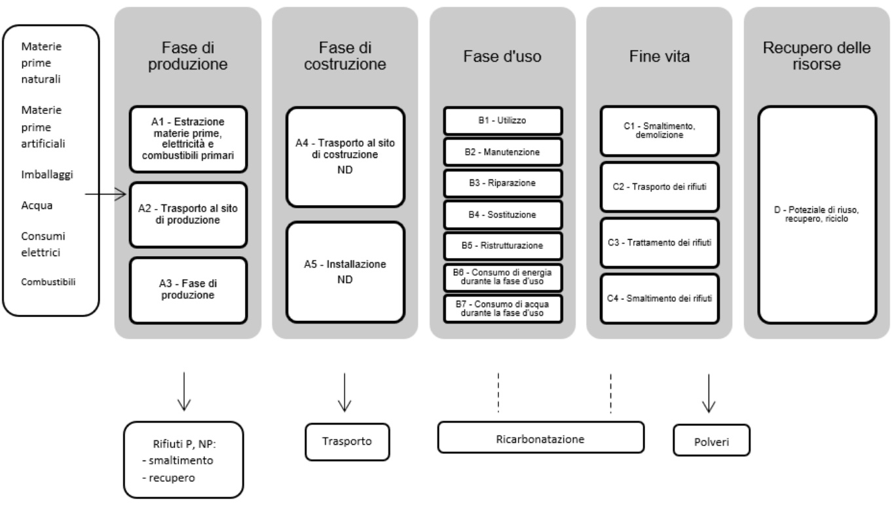  
Figura 3. Confini del sistema.  

In figura 3 sono riportati i moduli A1, A2, A3, relativi alla fase di produzione. I moduli facoltativi A4 ed A5, identificati  in figura con “ ND ”, moduli “ non dichiarati ” (“not declared”) sono stati esclusi dallo studio finale in quanto  ammissibile farlo. I moduli A1, A2, A3 ed eventualmente A4 ed A5 qualora siano considerati, sono gli unici ad  essere di competenza diretta del produttore. Gli altri moduli (B1-B7, C1-C4, D) che devono essere  obbligatoriamente dichiarati nello studio LCA, come indicato nella UNI EN 15804, hanno qui una impostazione di  default definita da Quantis. Per gli ulteriori dettagli si rimanda allo studio LCA di carattere generale sviluppato da  Quantis e al file di dettaglio (LCI, LCIA, LCA results) generato dal sistema GCCA-Tool stesso.  

Nel Sistema confluiscono i dati relativi alle quattro fasi previste nell’LCA quali:  

•  Fase di produzione  (A1, A2, A3) ; 

 •  Fase di costruzione, se dichiarata (A4, A5);  

 •  Fase d’uso  (B1, B2, B3, B4, B5, B6, B7);  

 •  Fine vita  (C1, C2, C3 e C4) ;  

 •  Recupero delle risorse  (D).  

All’interno della  Fase di produzione  rientrano i seguenti dati relativi alla:  

•  Quantità di risorse utilizzate durante la fase di produzione (cemento, aggregati, additivi e acqua); 

 •  Trasporto delle risorse fino all’impianto produttivo; 

 •  Consumi elettrici ${\sf e}/{\sf o}$  energetici per la produzione: per la modellizzazione dell’elettricità si utilizza il residual mix  nazionale fornito da AIB relativo all’anno di riferimento, adottando il criterio numero 3 del par. 4.8.1 della PCR  2019:2014. Il mix energetico impiegato ha un impatto climatico pari  a 7,62 E -01 kgCO 2  eq/kWh .  

 •  Flussi in uscita (rifiuti e componenti per il riutilizzo).  

Sono esclusi da tutti I processi descritti gli impatti inerenti alla costruzione e l’utilizzo delle strutture e degli impianti  utilizzati perla produzione del calcestruzzo.  

Gli impatti relativi allo smaltimento dei rifiuti, sono modellati secondo il principio di allocazione Polluters Pays (PP),  “chi inquina paga”.  

All’interno della  Fase di costruzione  ( se dichiarata ) entrano principalmente i dati del:  

•  Consumo di combustibile impiegato per il trasporto del materiale fino al cantiere.  

All’interno della  Fase d’uso  confluiscono i dati relativi alla:  

•  Metodologia per la quantificazione del processo di ricarbonatazione; 

 •  Tipologia dell’opera all’interno della quale è utilizzato il calcestruzzo.  

Nella  Fase di fine vita  rientrano i   dati della:  

•  Quantità di polveri emesse durante la fase di demolizione; 

 •  Percentuale potenziale di riciclaggio del materiale; 

 •  Metodologia per la quantificazione del processo di ricarbonatazione durante la demolizione e il deposito in  discarica.  

Nella  Fase di recupero delle risorse  entrano i dati relativi al potenziale recupero del materiale.  

In generale, in conformità con gli standard di riferimento, i criteri di cut-off sono fissati all’ $1\%$  dei flussi di massa e  di energia.  

Si precisa che nelle tabelle in cui sono riportati i risultati, i valori nulli sono indicati con la cifra $"{\mathfrak{o}}"$ , quelli  non disponibili con il tratto “-”.  

Ulteriori informazioni :  I criteri per l'esclusione dei dati di input e di output, “criteri di cut-off”, sono fissati all’ $1\%$ ,  in termini di massa, energia e rilevanza ambientale. Questo vuol dire che un processo può essere trascurato se il  suo contributo è inferiore all’ $1\%$  della massa totale, dell'energia primaria e dell'impatto totale. Vengono comunque  presi in considerazione tutti i processi per i quali i dati sono disponibili, anche se con un contributo inferiore all’ $1\%$ .  L'allocazione viene evitata quando possibile dividendo il sistema in sottosistemi. Quando l'allocazione non può  essere evitata, viene applicata l'allocazione di massa. Per la modellizzazione dei rifiuti si applica il principio: “chi  inquina paga”.  

Il presente report risulta valido per tutti i prodotti elencati in copertina e i risultati dichiarati si riferiscono  al prodotto più rappresentativo (opzione 2, par. 2.2.2 della PCR 2019:14 ver. 1.3.2), indipendentemente  dall’uso che ne viene fatto, quindi per opere di ingegneria civile o infrastrutture, in quanto per il calcolo  degli indicatori si considera l’opzione più conservativa.  

# Moduli dichiarati, scopo geografico, quota di dati specifici (per l’indicatore GWP-GHG) e  variazione dei dati:  

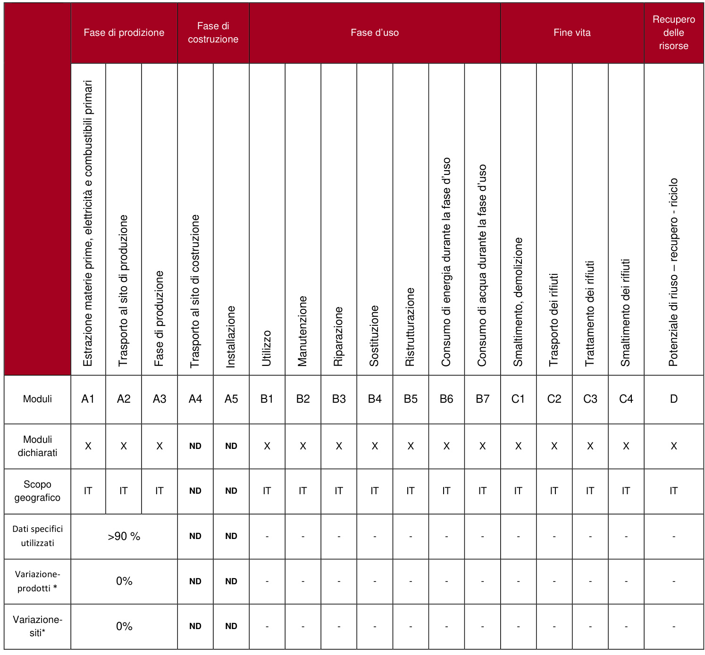  
Figura 4. – Moduli inclusi ${\mathfrak{M}}.$ , moduli non dichiarati (ND), scopo geografico (IT $=$  Italia)  

$^{\star}{\sf D a}$  compilare solo se il report si riferisce a più prodotti; altrimenti inserire $0\%$  

# SOMMARIO  

La produzione del calcestruzzo è modellata attraverso i dati primari raccolti per le unità produttive riportate a  pagina 2.  

Il periodo di riferimento per la raccolta dati è stato l’ anno 2023 .  La quantità totale del calcestruzzo prodotto nel periodo di riferimento per lo studio è di $\mathbf{0}\,\mathbf{m}^{3}$ .  Nel caso di EPD multiplo la quantità di calcestruzzo prodotto è riferita al solo prodotto più rappresentativo.   Si riportano di seguito alcuni indicatori significativi a scopo riassuntivo.  

# Tabella 1- indicatori più significativi.  

  

# Informazioni sul contenuto  

Tabella 2- Composizione di 1 $\mathfrak{m}^{3}$   di calcestruzzo 
  

Non si riporta la composizione del packaging perché il prodotto  $\grave{\Theta}$ venduto sfuso, cioè privo di  imballaggio.  

Non si riporta il contenuto di sostanze pericolose dall'elenco delle sostanze candidate di SVHC per  l'autorizzazione perché il calcestruzzo ne è naturalmente privo.  

# PERFORMANCE AMBIENTALI  

# Tutti i risultati sono relativi ad un’unità dichiarata:  $\mathbf{\lambda}_{1}\mathbf{\mathfrak{m}}^{3}$  di calcestruzzo.  

I risultati stimati dell'impatto sono solo affermazioni relative, che non indicano né i limiti (superiori o inferiori) delle categorie di impatto, né il superamento dei valori di soglia, né i margini di sicurezza e/o i  rischi.  

RIULTATI DEGLI INDICATORI D’IMPATTO AMBIENTALE OBBLIGATORI  

Tabella 3- Indicatori obbligatori della categoria di impatto secondo EN 15804  

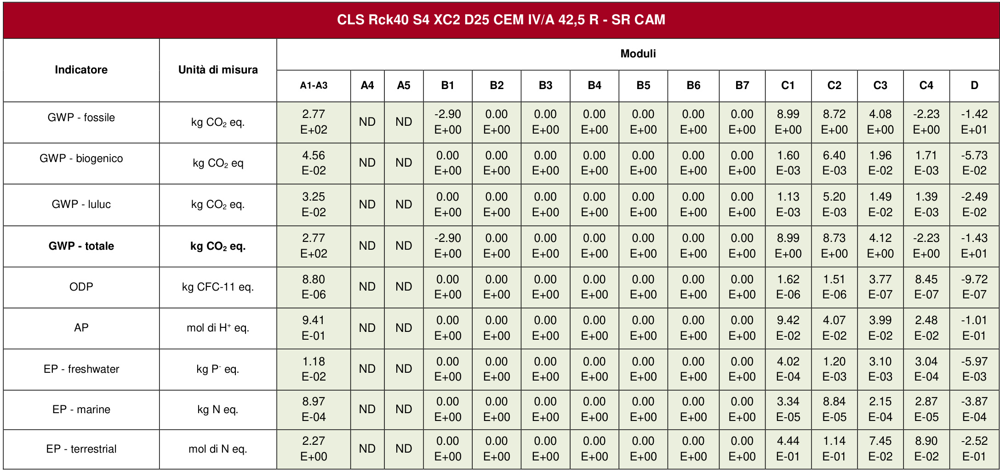  

  

# INDICATORI DI IMPATTI AMBIENTALI DI CATEGORIA AGGIUNTIVI OBBLIGATORI E VOLONTARI  

Tabella 4-Indicatori di impatti ambientali di categoria aggiuntivi obbligatori e volontari.  

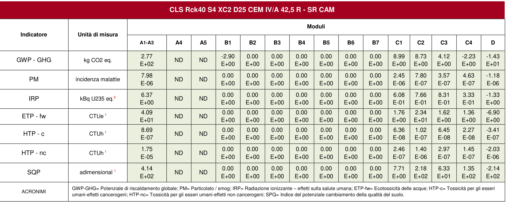  

# CONSUMO DI RISORSE  

Tabella 5- consumo di risorse  

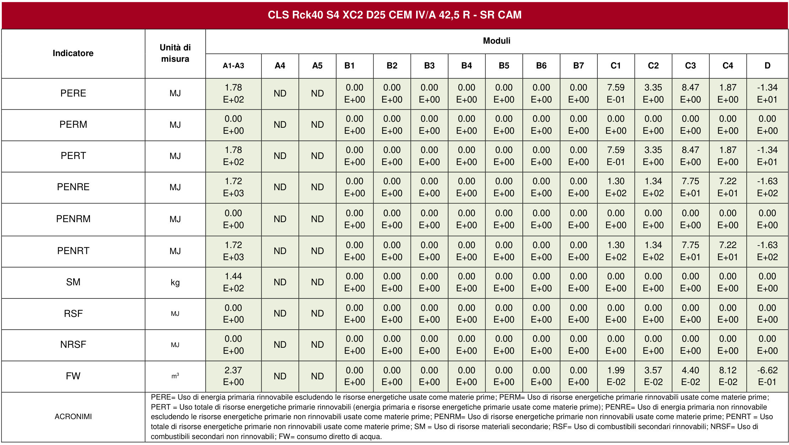  

# RIFIUTI GENERATI  

Tabella 6- Rifiuti generati. 
  

I rifiuti prodotti nell’impianto derivano dagli scarti di lavorazione della produzione del calcestruzzo e secondariamente, in modeste quantità, dalle attività di servizio quali  manutenzioni, pulizie, magazzino, officine, uffici, ecc.  

# FLUSSI IN USCITA  

Tabella 7- flussi in uscita.  

  

# INFORMAZIONI AMBIENTALI AGGIUNTIVE  

La Tabella 8 riporta alcune informazioni ambientali aggiuntive:  

•  Contenuto di materiale riciclato, recuperato e sottoprodotto;  •  Contenuto totale di materiale riciclato, recuperato e sottoprodotto  

calcolate secondo le indicazioni della Istruzione Operativa interna IO-CB-30 “Criteri Ambientali Minimi (C.A.M.)”   sviluppata da Colabeton ed espresse in percentuale in massa, conformi al D.M. 23 giugno 2022 “Criteri ambientali  minimi per l’affidamento del servizio di progettazione di interventi edilizi, per l’affidamento dei lavori per interventi  edilizi e per l’affidamento congiunto di progettazione e lavori per interventi edilizi” - G.U. Anno  $163^{\circ}$  - Numero 183,  Roma - Sabato, 6 agosto 2022, e quindi valevoli ai fini CAM.  

Abbiamo inoltre:  

•  Contenuto di materiale pre -consumer;  •  Contenuto di materiale post-consumer;  

definiti in conformità alla norma UNI EN ISO 14021:2021, par. 7.8.1.1 – A1 e par. 7.8.1.1 – A2 ed espressi in  percentuale in massa.  

Tabella 8- Contenuto di materiale riciclato, recuperato e sottoprodotto.  
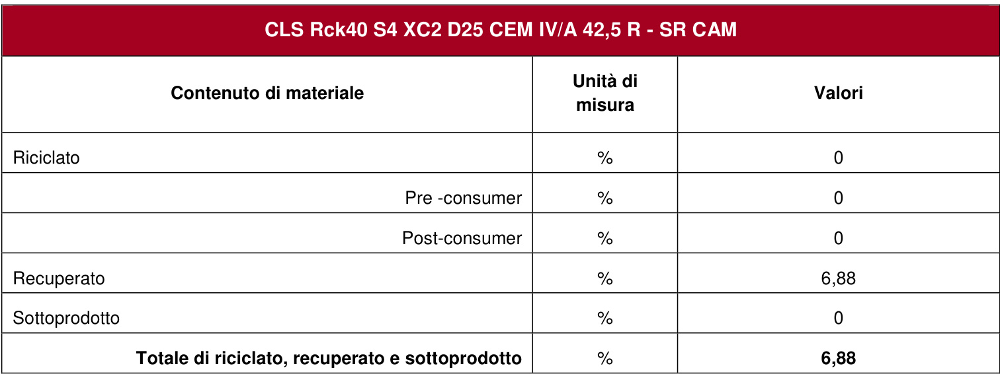  

La Tabella 9 riporta infine la provenienza delle materie prime del cemento calcolata mediante metodo interno 

 (Google  Maps).  I  risultati  all’interno  della  Tabella  9  sono  forniti  per  1  $\mathsf{m}^{3}$   di  calcestruzzo.  

Tabella 9- Distanza di provenienza dei componenti del prodotto.  
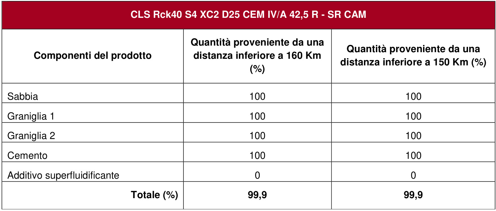  

# RIFERIMENTI  

1. EN 15804:2012+A2:2019/AC:2021: 2019 “Sustainability of construction works - Environmental product  declarations - Core rules for the product category of construction products”. 

 2. PCR 2019:14 (ver. 1.3.2) “Construction products (EN 15804:A2)”; 

 3. UNI EN 15804:2021 “Sostenibilità delle costruzioni – Dichiarazioni ambientali di prodotto – Regole quadro di  sviluppo per categoria di prodotto”. 

 4. UNI EN 16757:2022 “Sostenibilità delle costruzioni - Dichiarazioni ambientali di prodotto - Regole quadro per  categoria di prodotto per calcestruzzo ed elementi di calcestruzzo”.    

 5. ISO 14040:2021 “Environmental management - Life cycle assessment - Principles and framework”. 

 6. ISO 14044:2018 “Environmental management - Life cycle assessment - Requirements and guidelines”. 

 7. ISO 14025:2006 “Environmental labels and declarations - Type III environmental declarations - Principles and  procedures”. 

 8. UNI EN ISO 14021:2021 “Etichette e dichiarazioni ambientali - asserzioni ambientali auto-dichiarate  (etichettatura ambientale di tipo II)”. 

 9. GPI VERSION 4.0 2021-03-29 “General Programme Instructions for the International EPD ®  System”.  

 10. IO-CB-30 “Criteri Ambientali Minimi (C.A.M.)” - istruzione operativa interna.   

 11. DECRETO MINISTERIALE 23 giugno 2022 “Criteri ambientali minimi per l’affidamento del servizio di  progettazione di interventi edilizi, per l’affidamento dei lavori per interventi edilizi e per l’affidamento congiunto  di progettazione e lavori per interventi edilizi” - G.U. Anno  $163^{\circ}$  - Numero 183, Roma - Sabato, 6 agosto 2022.  

 12. UNI PdR 88:2020.  

for the calendar year 2023’ , version 1.0, 2024-06-05.  

# GLOSSARIO  

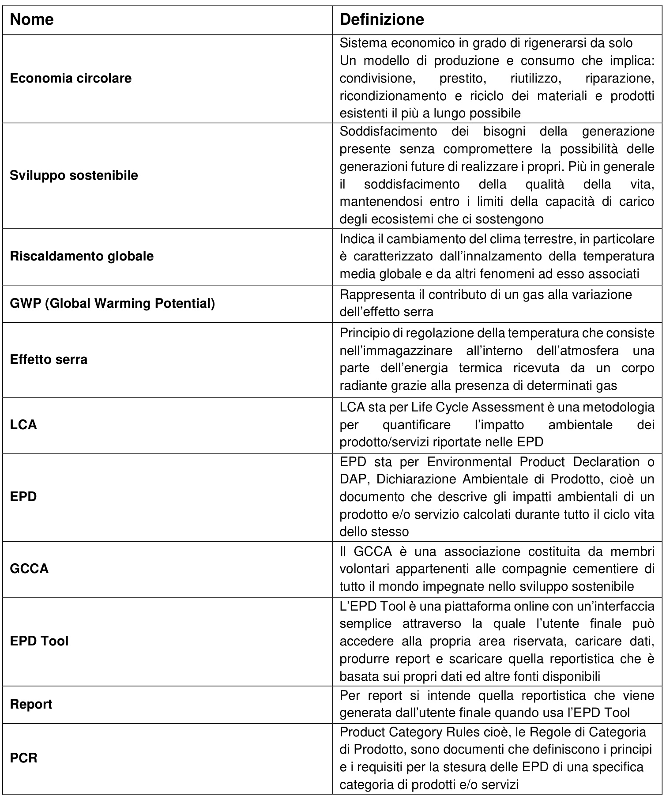  

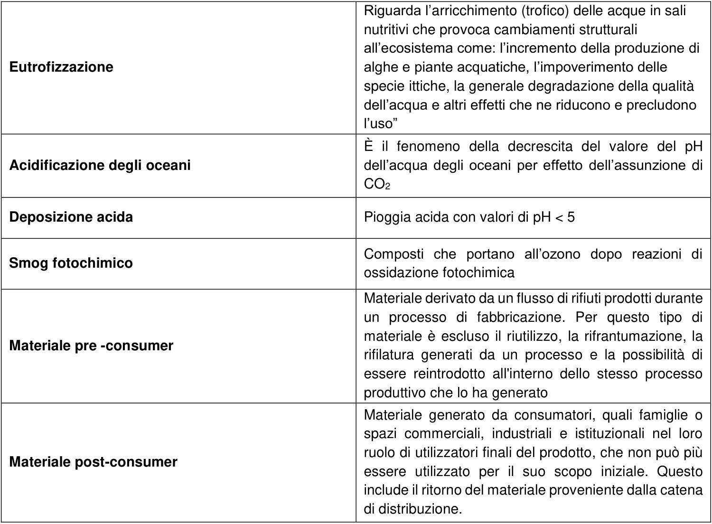  

# SUMMARY  

For the evaluation of impact, the declared unit of concrete is $\pmb{1}\,\pmb{\mathfrak{m}}^{3}$ . The concrete studied is  CLS Rck40 S4 XC2 D25 CEM IV/A 42,5 R - SR CAM.   The reference period for the collected data is the  year 2023 . The total amount of concrete made, in the considered period, is $\mathbf{0}\,\mathbf{m}^{3}$ . According to UNI EN 15804:2012+A2:2019/AC2021 the study spans from “cradle to gate  with options”, with the modules: A1, A2, A3, B1, B2, B3, B4, B5, B6, B7, C1, C2, C3, C4 e D. Exclusion of input and output data, i.e. “cut off criteria”, is fixed at  $1\%$ , in term  of mass, energy and environmental relevance. Thus, a process can be neglected if its contribution is minor to $1\%$  of the total mass, primary energy and total impact. However,  all processes for which data are available are considered, even though with a contribution minor than  $1\%$ . The production of concrete is modelled by primary data collected  in  Colabeton S.p.a Taurisano (LE)  the production site for the above said considered reference period. Allocation is avoided, whenever possible, by dividing the system into  sub-systems. When allocation cannot be avoided, mass allocation is applied. For the modeling of waste, the “Polluter pays principle” is applied. The environmental potential  impacts, for $1\ \mathsf{m}^{3}$   of concrete are listed below.  

Table 10- Environmental Potential Impact for $\mathbf{1}\,\mathbf{m}^{3}$  of concrete  
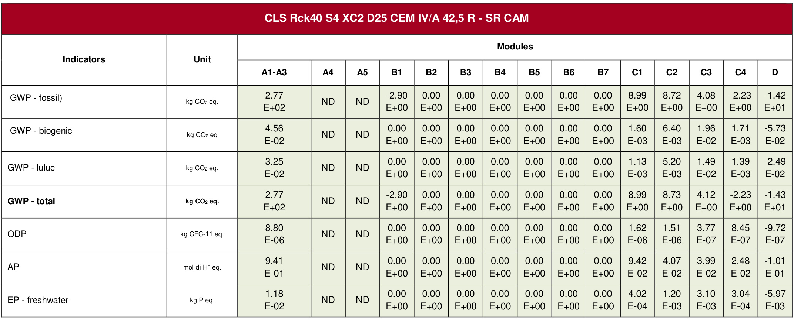  

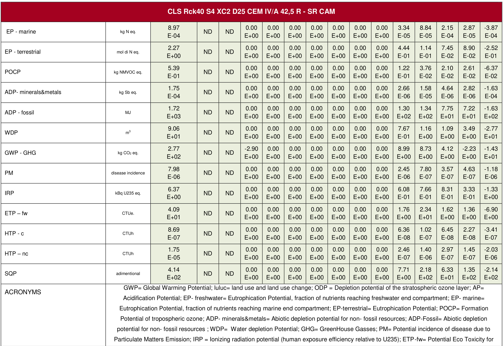  

  

GPI:  General Programme Instructions for the International $\mathsf{E P D^{\mathrm{\textregistered}}}$ Database:  for evaluation   EPD Tool :  GCCA EPD Tool Version 4.2;  LCA Model:  international version, ver 4.2, 2023-12-18, Quantis (Lousanne, Swiss);  Type : Environmental Product Declaration (EPD).  

  