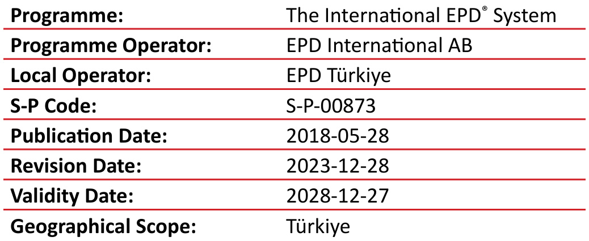  

ENVIRONMENTAL  PRODUCT  DECLARATION  

Ceramic Wall Tiles  

Manufactured by by Kaleseramik Çanakkale Kalebodur Seramik Sanayi A.Ş. in  accordance with ISO 14025:2006  and EN 15804:2012 2+A2:2019/AC:2021  

# Programme Information  

ISO standard ISO 21930 and CEN standard EN 15804 serves as the  core Product Category Rules (PCR).  

Product Category Rules (PCR): 2019:14 Version 1.3.3, 2024-12-20, Construction Products and  Construction Services, EN 15804:2012+A2:2019/AC:2021 for  Sustainability of Construction Works  

PCR review was conducted by: The Technical Committee of the  International $\mathsf{E P D^{\mathrm{\textregistered}}}$  System. Review chair: Claudia A. Peña, University  of Concepción, Chile  

EPDs within the same product category but registered in different  EPD programmes may not be comparable. For two EPDs to be  comparable, they must be based on the same PCR (including  the same version number) or be based on fully-aligned PCRs or  versions of PCRs; cover products with identical functions, technical  performances and use (e.g. identical declared/functional units);  have equivalent system boundaries and descriptions of data; apply  equivalent data quality requirements, methods of data collection,  and allocation methods; apply identical cut-off rules and impact  assessment methods (including the same version of character is ation  factors); have equivalent content declarations; and be valid at the  time of comparison.  

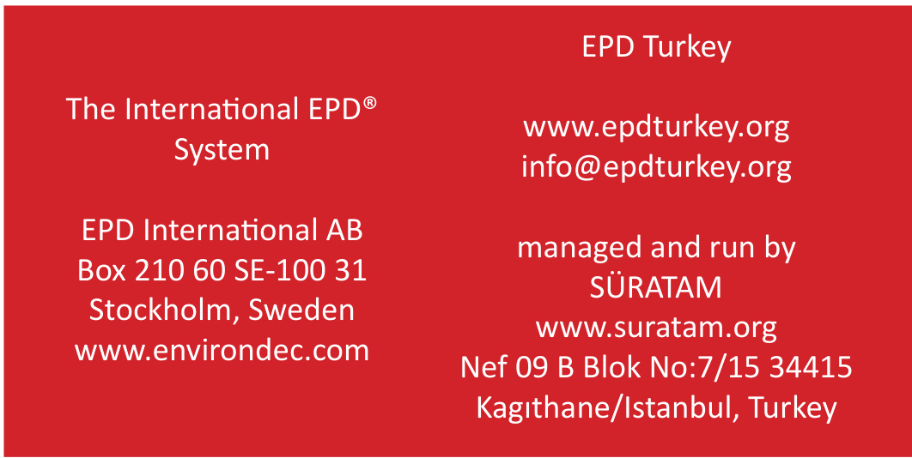  

# Third-party verification  

Independent third-party verification of the declaration and data,  according to ISO 14025:2006, via:  

EPD verification by individual verifier  

Third party verifier: Prof. Ing. Vladimír Koçí, Ph.D., MBA, LCA Studio  Šárecká 5,16000 Prague 6 - Czech Republic  

Approved by: The International EPD® System  

Procedure for follow-up of data during EPD validity involves third  party verifier:  

Kaleseramik Çanakkale Kalebodur Seramik Sanayi A.Ş.  has the sole  ownership, liability, and responsibility for this EPD.  

# How To Read This EPD?  

An Environmental Product Declaration (EPD) is an ISO Type III  Environmental Declaration based on ISO 14025 standard. An EPD  transparently reports the environmental performance of products  or services from a lifecycle perspective. The preparation of an EPD  includes different stages, from acquiring raw materials to the end  of life of the final product/service. EPDs are based on international  standards and consider the entire value chain. Additionally,  EPD is  a third-party verified document . This EPD includes the following  sections described below.  

# 1. General and Program Information  

The first part of an EPD has information about the name of the  manufacturer and product/service and other general information  such as the validity and expiration dates of the document, the name  of the program operator, geographical scope, etc. The second page  states the standards followed and gives information about the  program operator, third-party verifier, etc. The followed Product  Category Rule (PCR) is indicated on the second page.  

# 2. Company and Product/Service Information  

Information about the company and the investigated product is  given in this section. It summarizes the characteristics of the product  provided by the manufacturer. It also includes information about  the product such as product composition and packaging.  

# 3. LCA Information  

Life Cycle Analysis (LCA) information is one of the most important  parts of the EPD as it describes the functional/declared unit, time  representative ness of the study, database(s) and LCA software,  along with system boundaries. The table presented in this part has  columns for each stage in the life cycle. The considered stages are  marked  $\mathbf{\acute{X}}^{\prime}$  whereas the ones that are not considered are labeled  as ‘NR’ (Not Relevant). Not all EPDs consider the full life cycle  assessment for a product’s entire life stages. The ‘System Boundary’  page is also the place where one can find detailed information about  the stages and the assumptions made.  

# 4. LCA Results  

The results of the LCA analysis are presented in table format. The  first column in each table indicates the name of the impact category  and their measurement units are presented in the second column.  These tables show an amount at each life cycle stage to see the  impact of different indicators on different stages. Each impact can  be understood as what is released through the production of the  declared unit of the material. The benefits of reuse/recycling of the  declared product are reflected in this section.  

The first impact in the table is global warming potential (GWP),  which shows how much  $\mathsf{C}\mathsf{O}_{2}$  is released at each stage. Other  impacts include eutrophication potential, acidification potential,  ozone layer depletion, land use related impacts, etc. The second  table provides results for resource use and the third table is about  the waste produced during production. The fourth and final table  shows the results for the GWP-GHG indicator, which is almost  equivalent to the GWP-Total indicator mentioned previously. The  only difference is that this indicator excludes the biogenic carbon  content by following a certain methodology.  

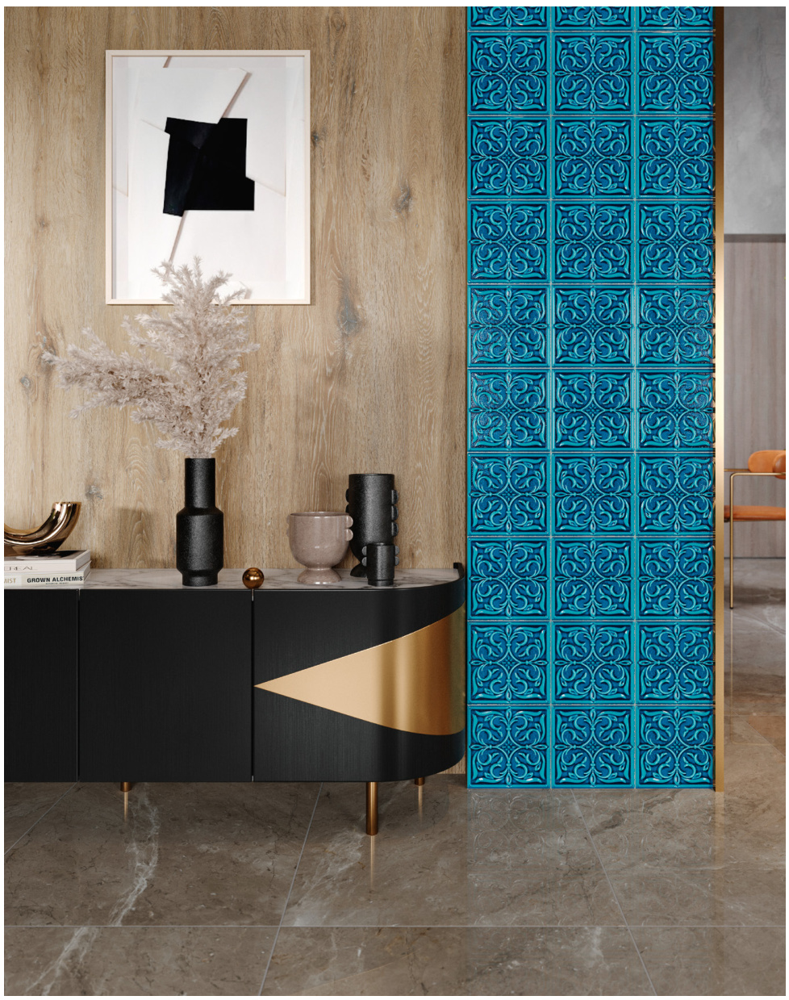  

# About  

Laying its foundation with Çanakkale Ceramic Factories Corporation in  1957, Kale Group pioneered the formation of the ceramics industry in  Turkey, and has become an industry giant with its investments. It has  grown over the course of time with investments in construction products,  machinery and equipment manufacturing, defence, chemistry, electrical  appliances, energy, IT, transportation, tourism and food industries. Kale  Group is currently comprised of 17 companies, and is regarded as one  of the most important industrial enterprises of Turkey with over 5000  employees, spanning over a geography across Çanakkale to several  locations in Turkey to Italy and Russia. Today, Kale Group is Europe’s  3rd and the world’s 12th largest ceramics manufacturer. Kale Group  provides its products to consumers in over 100 countries via more than  400 sales points.  

Kaleseramik, a company of Kale Group, manufactures ceramic tiles with  a production capacity of 66 million $\mathsf{m}^{2}$  ceramic tile/year. Kaleseramik’s  tile products take place in market under Çanakkale Seramik, Kalebodur  and Kale brand names.  

Kaleseramik that aims for continuous development has received the  following certifications within the scope of the system standards; TS EN  ISO 9001:2015, TS ISO 10002:2018, TS EN ISO 14001: 2015, TS EN ISO  50001: 2018, ISO 27001: 2013, TS ISO 45001: 2018.  

# About Product  

# Product Description  

Kaleseramik produces 2200 varieties of wall tiles in 60 different  dimensions. Kaleseramik Wall tiles are primarily made of kaolin and  clay, but they also include other raw materials such as marble, frit,  dolomite, bentonite and quartz. The production technology of tiles  is dry pressing. The required composition is blended with water to  form uniform slurry. This slurry then fed into spray driers to form  uniform granules ready for compaction. These granules are then  shaped to form the bisque or green body. This can be glazed or left  unglazed depending on its intended use. The green ceramic body is  fired at high temperatures, resulting in a hard body.  

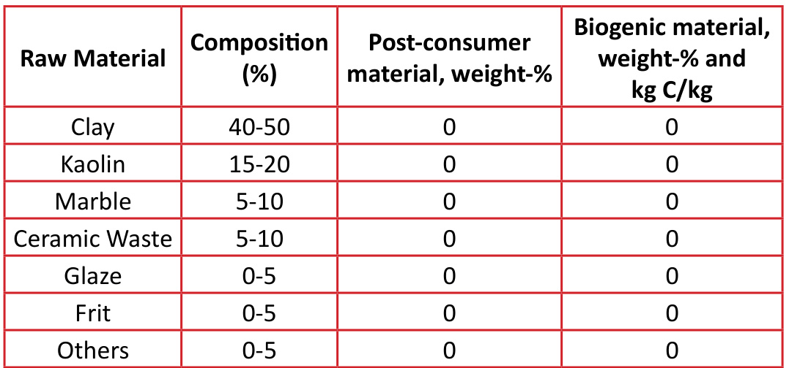  

# Areas of Use  

Kaleseramik Wall Tiles are largely used as interior and exterior wall  coverings. Interior applications are mainly in bathrooms and kitchens  in residential applications while the exterior applications can include  swimming pools, façades, commercial and industrial applications  etc. For interior applications, ceramic wall tiles should be selected  regarding the technical specifications such as PEI value, hardness,  stain resistance, chemical resistance and easy cleaning, if they are  to be used in the interiors of a residence. The tiles selected for  exteriors should be frost resistant and have low water absorbency.  For outdoor uses they normally have less than $3\%$  water absorption  but for internal applications this might rise to  $16\%$ . Depending on  the use, ceramic tiles might be glazed to control abrasion and slip  resistance.  

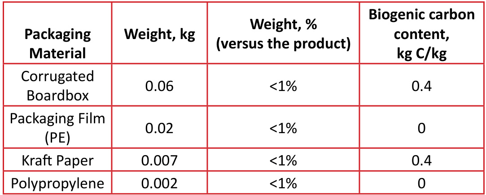  

# Technical Specifications  

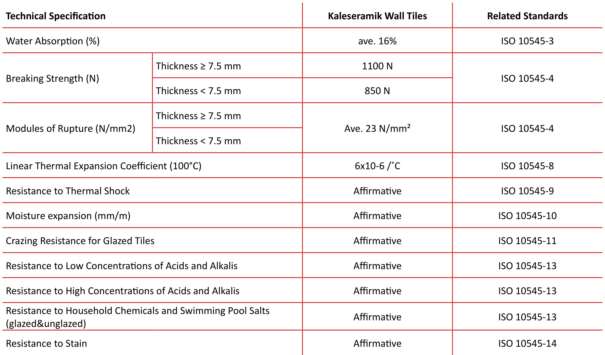  

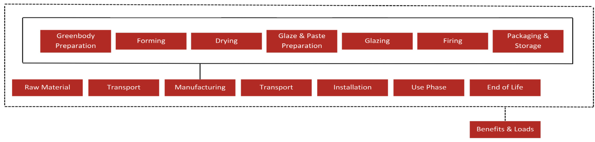  

# Product Stage  

# Use Stage  

A1-A3:  Represents raw material supply which includes raw material  extraction and pre-treatment processes before production. A2 relevant to  raw material transportation to the plant and A3 refers to the impact occurs  from manufacturing process.  

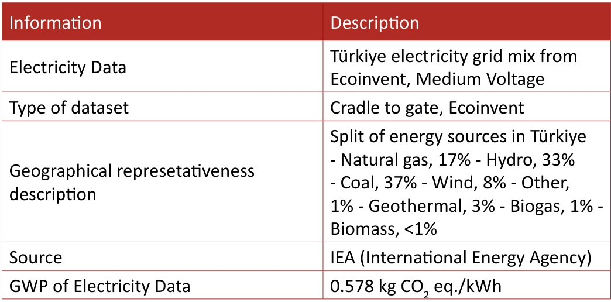  

# Construction Process Stage  

A4:  This stage is relevant to the transportation of the final product from the  factory gate to the customers.  

A5.  This stage includes the adhesive mortar and water usage in the  construction site. For  $1\;{\mathsf{m}}^{2}$  slab installation;  $3.3~\mathrm{kg}$  mortar and  $0.8~\mathsf{L}$  water  usage was assumed.  

B1:  Ceramic tile do not cause any emissions in the use stage because of the  inert feature. B2:  Usage of detergent containing stain remover or neutral lowsulphate and  rinsing with tap water after cleaning was assumed. $0.2\,\mathsf{m L}$  detergent and 0.1  L water use was assumed to wash $1\,\mathsf{m}^{2}$  ceramic tile. B3-B5:  Ceramic tile do not require any repairment during the use phase and  therefore no impacts should be declared. B6-B7:  Ceramic tile do not require any water and energy in the use phase and  therefore no impacts ocurred in this module.  

# End of Life Stage  

C1:  Deconstruction of ceramic at the end of their life is done manually. So no  impact occurs in this module.   C2:  Waste transport includes discarded ceramic tile and mortar to disposal  area. Distance from demolition site to inert landfill site for final disposal is  assumed as $50\,\,{\sf k m}$ . C3:  Environmental impacts generated during the crushing of discarded  ceramic tile before recycle or reuse. C4.  Disposal construction and demolition waste scenario is created separately  depending on the geographic location of the use phase. After domestic usage,  ceramic tile products end up at construction and demolition waste landfills  as their final fate and modelled as such in the LCA. D:  Inert filler benefits and recycling of packaging materials specified in the  disposal stage.  

# LCA Information  

# Functional / Declared Unit  

The declared unit is  $14.0\,\,{\sf k g}$  of $1\,\mathsf{m}^{2}$  average ceramic wall tiles.  

# REACH Regulation  

No substances included in the Candidate List of Substances of Very  High Concern for authorization under the REACH regulations are  present in this product either above the threshold for registration  with the European Chemicals Agency or above $0.1\%$  (wt/wt)  

# System Boundary  

The system boundary covers A1 - A3 product stages referred as 

 ‘Raw material supply’, ‘Transport’ and ‘ Manufacturing’, A4 - A5 

 ‘Construction’, B1 - B7 ‘Use’ and C1 – C4 ‘End of life’ stages and  Module D ‘Benefits & Loads’.  

# Cut-off Rules  

For this LCA study, no cut-off criteria was applied.  

# Background Data  

For all LCA modelling and calculation, Ecoinvent database (v3.9) and  SimaPro (v9.5) LCA software were used.  

# Period Under Review  

The data used for LCA study concerns the year 2022.  

# LCA Modelling, Calculation and Data Quality  

The results of the LCA with the indicators as per EPD requirements  are given in the LCA result tables. All energy calculations were  obtained using Cumulative Energy Demand (LHV) methodology,  while freshwater use is calculated with selected inventory flows in  SimaPro according to the PCR. There are no co-product allocations  within the LCA study underlying this EPD. The regional energy  datasets were used for all energy calculations.  

# Allocations  

There are no co-products in the production of ceramic tile  manufactured by Kaleseramik. Hence, there was no need for  co-product allocation. Kaleseramik sources raw materials from  different l ocations across Turkey and other parts of the world and  by different means of transport (truck and ship). For this reason,  transport was allocated according to tonnages for almost all raw  materials bought by Kaleseramik. Kaleseramik manufactures  various ceramic tiles in the Company’s Çanakkale plant in Turkey.  Electricity and combined heat power (CHP) powered by natural gas  are used. Raw materials, transport, packaging, waste, and energy  consumption data were allocated for each product using related  production tonnages from Kaleseramik’s Çanakkale plant for the  average product.  

# LCA Information  

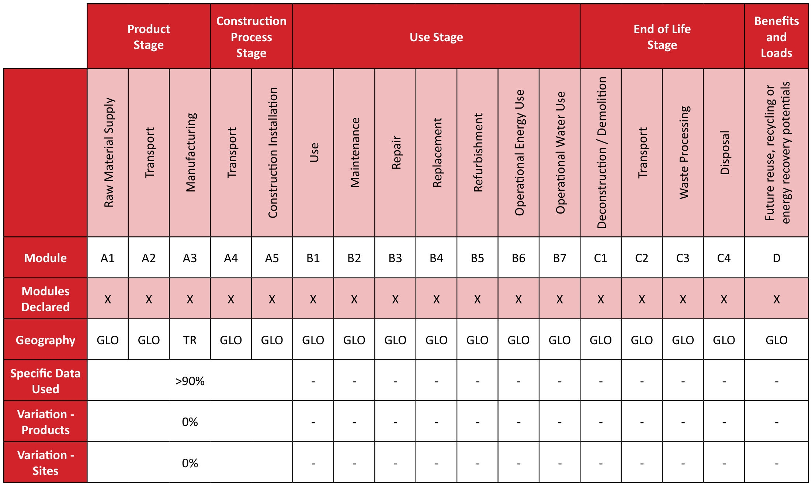  
( $\mathsf{X}=$  Module included, - $=$  Module not included)  

# LCA Results  

It is discouraging the use of the results of modules A1-A3 (A1-A5 for services) without considering the results of module C. The estimated impact  results are only relative statements, which do not indicate the endpoints of the impact categories, exceeding threshold values, safety margins and/or  risks.  

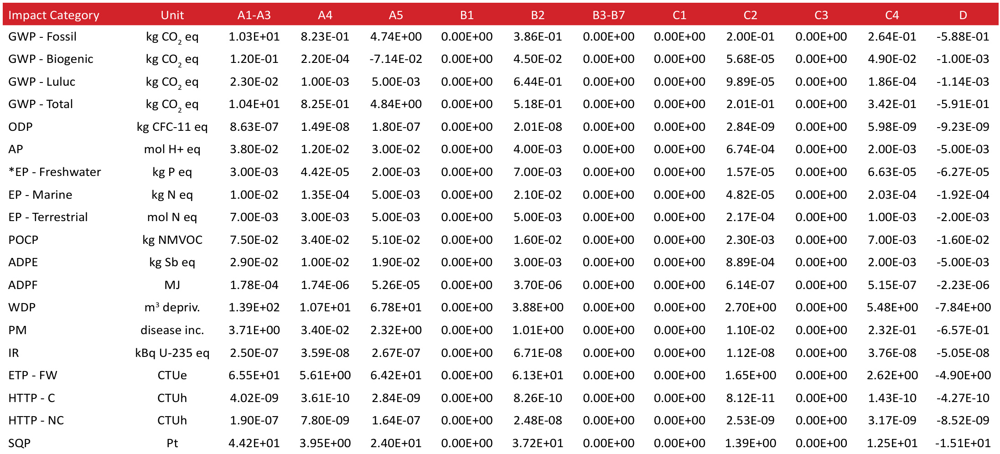  

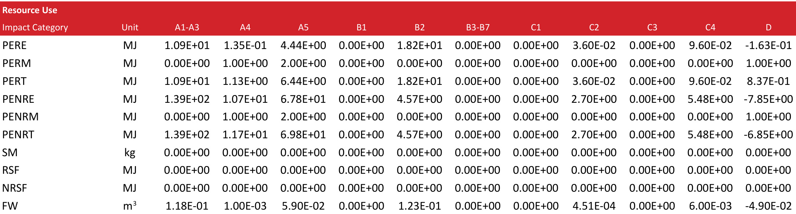  

Waste & Output Flows 
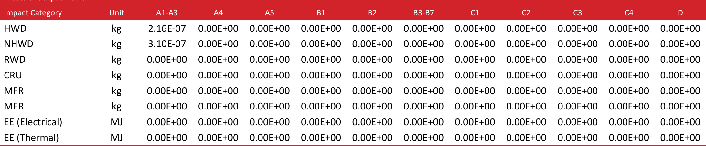  

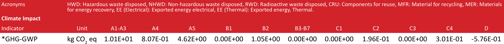  

# References  

/ISO 9001:2015/ Quality Management Systems  

/ISO 50001:2018/ Energy Management Systems  

/GPI/ General Programme Instructions of the International $E P D^{\scriptscriptstyle{(\!B)}}$  System. Version 4.0.  

/ISO 14020:2000/ Environmental Labels and Declarations — General principles  

/EN 15804:2012+A2:2019/ Sustainability of construction works - Environmental Product Declarations — Core rules for the product category of construction products  

/ISO 14025/ DIN EN ISO 14025:2009-11: Environmental labels and declarations - Type III environmental declarations — Principles and procedures  

/ISO 14040/44/ DIN EN ISO 14040:2006-10, Environmental management - Life cycle assessment - Principles and framework (ISO14040:2006) and Requirements and guidelines (ISO 14044:2006)  

/PCR 2019:14 Construction products (EN 15804: A2) (1.3.1) prepared by IVL Swedish Environmental Research Institute, EPD International Secretariat, date 2023-12-08.  

/The International $E P D^{\circledast}$  System/ The International  $E P D^{\scriptscriptstyle{(\!B)}}$  System is a programme for type III environmental declarations, maintaining a system to verify and register $E P D^{\circledast}\mathsf{S}$  as well as keeping a library of $E P D^{\circledast}\mathsf{S}$  and PCRs in accordance with ISO 14025. www.environdec.com  

/Ecoinvent / Ecoinvent Centre, www.ecoinvent.org  

/SimaPro/ SimaPro LCA Software, Pré Consultants, the Netherlands, www.pre-sustainability.com  

/Kaleseramik/ www.kale.com.tr  

Metsims / www.metsims.com  

# Contact Information  

# Programme  

# Programme operator  

# Owner of the declaration  

# LCA practitioner and EPD Design  

# 3rd party verifier  

The International $\mathsf{E P D^{\mathrm{\tiny{\otimes}}}}$  System www.environdec.com  

EPD International AB Box 210 60 SE-100 31 Stockholm, Sweden  

www.environdec.com info@environdec.com  

Metsims Sustainability Consulting  

Türkiye: Nef 09 B Blok NO:7/46-47 34415 Kagıthane/Istanbul, TÜRKIYE +90 212 281 13 33  

EPD registered through fully aligned regional programme: EPD Turkey www.epdturkey.org info@epdturkey.org  

SÜRATAM A.Ş. Nef 09 B Blok No:7/15, 34415 Kağıthane / İstanbul, TÜRKİYE www.suratam.org  

# Kaleseramik Çanakkale Kalebodur Seramik Sanayi  A.Ş.  

Büyükdere Cad. Kaleseramik Binası 34330 Levent, Istanbul - Turkey  

www.kale.com.tr  

The United Kingdom: 4 Clear Water Place Oxford OX2 7NL, UK 0 800 722 0185  

www.metsims.com info@metims.com  

LCA Studio Šárecká 5,16000 Prague 6 - Czech Republic www.lcastudio.cz  

Prof. Ing. Vladimír Kočí, Ph.D., MBA  