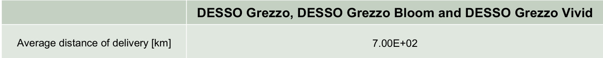

# Environmental Product  Declaration  

In accordance with ISO 14025 and EN 15804:2012+A2:2019 for:  

# DESSO Grezzo, DESSO Grezzo Bloom and  DESSO Grezzo Vivid  

from  TARKETT  

  

Programme:  Programme operator:   EPD registration number: Publication date:   Revision date:  Valid until:  

The International  $\mathsf{E P D^{\mathrm{\tiny{\circledast}}}}$  System,  www.environdec.com  EPD International AB  S-P-08952  2023-04-17  2024-05-23  2028-04-17  

An EPD should provide current information and may be updated if conditions change. The stated  validity is therefore subject to the continued registration and publication at www.environdec.com  

  

# General information  

Programme information   
  

The EPD owner has the sole ownership, liability, and responsibility for the EPD.  

EPDs within the same product category but registered in different EPD programmes, or not compliant  with EN 15804, may not be comparable. For two EPDs to be comparable, they must be based on the  same PCR (including the same version number) or be based on fully-aligned PCRs or versions of  PCRs; cover products with identical functions, technical performances and use (e.g. identical  declared/functional units); have equivalent system boundaries and descriptions of data; apply  equivalent data quality requirements, methods of data collection, and allocation methods; apply  identical cut-off rules and impact assessment methods (including the same version of character is ation  factors); have equivalent content declarations; and be valid at the time of comparison. For further  information about comparability, see EN 15804 and ISO 14025.  

# Company information  

Owner of the EPD: Tarkett  

Contact: Sandy Bentmim (sandy.bentmim@tarkett.com)   Description of the organisation:  

With an international coverage and a wide range of products, Tarkett has over 130 years of  experience in providing integrated solutions for floorings to professionals and end users.   Many of the most important architectural firms in the world and building professionals have chosen  Tarkett for the value of its products and for its consultation and service abilities. Therefore, Tarkett  floorings and sport surfaces are present in several prestigious architectural reference points. Tarkett  offers integrated solutions for floorings, able to meet the particular needs of customers. Our wide  range of designs, colours and models provides an infinite series of possibilities, contributing to create  a positive environment and a better quality of life for people.  

Tarkett operates with the utmost respect for the environment towards the realization of eco-friendly  products.  

Tarkett’s commitment to the environment is woven throughout its business. Cradle-to-Cradle principles  are, in fact, the basis of the design and production of every solution. Particularly, the lifecycle analysis  is used to continuously improve the production process, and so the products until their use stage,  disposal and recycling. The development of products that can be reused within internal production  cycles, or external ones in case of other individuals, has been an integral part of the business strategy  aimed at sustainability for many years. The WCM (World Class Manufacturing) management system  has been developed in 2009, and it includes the environmental pillar aimed to the elimination of losses  and to the growth of process efficiency.  

Product-related or management system-related certifications: ISO 14001, ISO 45001, WCM  manufacturing site  

Name and location of production site(s): Dendermonde (Belgium) and Waalwijk (Netherlands)  

# Product information  

Product name:   DESSO   Grezzo, DESSO Grezzo Bloom and DESSO Grezzo Vivid  Product identification: Carpet tiles with a  $100\%$  recyclable DESSO EcoBase ®1  backing and PA6 yarn  Product description: Loose-lay carpet tiles (EN 1307) with DESSO EcoBase ®  backing developed by  Tarkett. The service lifetime recommended by Tarkett is 10 years  UN CPC code: 2223Z  

# LCA information  

Functional unit / declared unit:  $1{\mathsf{m}}^{2}$  of floor covering with a reference service life (RSL) of 1 year for  specified characteristics application and use areas according to ISO 1307 and EN ISO 10874.  Reference service life: 1 year  

Time representative ness: 2022  

Database(s) and LCA software used: Ecoinvent 3.9.1, Simapro 9.5.0.2, EN 15804 reference package  based on EF 3.1  

Description of system boundaries: Cradle to grave and module D  $(\mathsf{A}+\mathsf{B}+\mathsf{C}+\mathsf{D})$  

System diagram:  

  

More information: The products are classified in accordance with EN ISO 10874, (previously EN 685)  and in reference to the FCSS (Floor Covering Standard Symbols) to be used in all professional areas  which require class 33 or less.  

Modules declared, geographical scope, share of specific data (in GWP-GHG indicator) and data  variation:  

  

Content information  
  

Chemical composition for above mentioned products is presented in the following table:  

  
\*EcoBase contains up to $82\%$  pre-consumer recycled chalk  

# Material Health  

DESSO Grezzo, DESSO Grezzo Bloom and DESSO Grezzo Vivid are C2C-Silver certified.   Raw materials are assessed against ’Material Health’ criteria as defined by the C2C product  certification standard v3.1 and the C2C Material Health Assessment methodology (see  www.c2ccertified.org).  

# Recycled content (third-party verified)  

DESSO Grezzo, DESSO Grezzo Bloom and DESSO Grezzo Vivid contains  $53.3\%$  recycled and bio- based content 2 . The products are delivered with the Cradle to Cradle ®  Gold-certified DESSO  EcoBase ®  backing, which is  $100\%$  recyclable 3  and designed with  $100\%$  positively defined 4  ingredients.  This includes chalk upcycled from the Dutch drinking water industry and pine rosin, a by-product of the  Scandinavian paper industry.  

# Product manufacturing  

# Production process  

The production of carpet tiles is presented in the following figure:  

  

# Renewable energy  

Our carpet tiles are produced with energy from  $100\%$  renewable sources. The electricity is coming  from renewable sources with Guarantees of Origin 5 .  

# Production waste  

  

# Delivery and installation  

# Delivery  

The average distribution distance between the factories and the installation site is presented in the  following table. The distribution is made by truck.  

  

# Installation  

Carpet flooring do not use any electric tools for their installation. If a cut is necessary, it could be done  with a manual tool.  

# Waste  

During the installation approximately $3\%$  of the flooring is lost as off-cuts. All flooring losses are sent to  incineration.  

# Packaging  

$50\%$  of the packaging materials goes to incineration and  $50\%$  goes to landfill except for wooden pallet  which are recycled.  

# Use Stage  

# Reference Service Life (RSL)  

For this product, the stated RSL is 1 year. It should be noted, however, that the service life of a carpet  flooring may vary depending on the amount and nature of floor traffic and the type and frequency of  maintenance. The manufacturer has provided this service life on the basis of his experience of flooring  manufacture and supply. This RSL is applicable as long as the product use complies with that defined  by ISO 14041 and ISO 10874 in accordance with the product’s classification. The service lifetime  recommended by Tarkett is 10 years.  

# Cleaning and maintenance  

The maintenance step concerns the cleaning of the floor. Tarkett has provided the recommended  maintenance routine for the product throughout the reference life. Water, detergent and electricity  consumption of the cleaning machine are considered in the LCA study:  

•   Common maintenance: 2 times / week  •   Periodical maintenance: 2 times / year  

  

# Prevention of structural damage  

To avoid excessive wear, usage should be restricted to the stated areas of application as outlined by  the norm ISO 10874.  

# End of Life  

Our circular approach to carpet tiles enables us to reduce the emission of greenhouse gases like  carbon dioxide, a major contributor to global warming. Tarkett has implemented a take-back and  recycling program called ReStart 6 . Via Tarkett’s Sales Network and with the help of logistic partners,  post-use carpet tiles are collected and returned to Tarkett’s carpet recycling centre in Waalwijk, the  Netherlands 7 . DESSO’s EcoBase products have been designed with disassembly and recycling in  mind, which allows for recovery of yarn and backing materials in a closed-cycle and without loss of  quality. The recycling process 8  is developed by Tarkett and unique in the market.  

The only carpet tile manufacturer with a closed-loop recycling system, we limit the use of virgin raw  materials for new products, and avoid common, carbon-emitting options such as incineration and the  landfill at product end-of-life.  

# Transport  

Carpets are recycled in the same factory where they are produced. So, the distance of transport between  installation sites and recycling site is the same as for the module A4 (average delivery distance to  customer).  

  

# Waste processing  

Basically, the process separates yarn and EcoBase ®  backing and makes these main material streams  available for the next carpet cycle, without loss of value and/or material properties (closed-loop  recycling).  

A small rest stream (mainly tuft cloth and SBR-compound) cannot be reused yet at the desired quality  level. At this moment in time those streams will be considered as fuels and raw material (chalk and  ATH) for the cement industry, until other outlets will be found.  

# Resource recovery  

Module D has been considered for this study in order to evaluate the possible environmental benefits  obtainable through the re-use of secondary materials in other production cycles. Particularly, the  module clearly describes the benefits and the environmental charges deriving from reusable products  exiting from the system, such as secondary materials or secondary fuels.  

Three outlets have been considered:  

•   Yarn  •   DESSO EcoBase ®  backing  •   Others compounds  

PA6 yarn will be sent to Tarkett’s yarn supplier Aquafil for de polymerization and reuse in new carpet  yarns. This post-use material stream can be used for  $100\%$  and without quality loss for the production  of new carpet yarns.  

DESSO EcoBase ®  backing is  $100\%$  recyclable in Tarkett’s own production process. Post-use material  can be directly recovered in Tarkett’s production for the same purpose and avoids the production and  use of primary material.  

A small rest fraction is recycled in the cement industry. The chalk and ATH content substitutes primary  chalk, which is a raw material for the production of cement. Organic residues substitute primary fuel for  processing.  

# Interpretation of results  

The environmental impact of DESSO EcoBase products should be considered over the whole life  cycle and beyond, including all module A-D. DESSO EcoBase consists of a novel recipe, specially  designed to enable post-consumer recycling on a high level, which means, for the same purpose and  without quality loss.  

The original EcoBase backing was introduced in 2010. Because of the relatively long service life-time  (10 years), the majority of current products are still in their first cycle, meaning that recycled content is  still very minimal and not included in the calculations.  

# Environmental Information  

Potential environmental impact   
  
\* Disclaimer: The results of this environmental impact indicator shall be used with care as the uncertainties of these results are  high or as there is limited experience with the indicator.  

# Use of resources  

Waste production and output flows 
  

  

Information on biogenic carbon content  
  
Note: 1 kg biogenic carbon is equivalent to 44/12 kg  $C O_{2}.$ .  

# Additional mandatory and voluntary impact category indicators  

This indicator accounts for all greenhouse gases except biogenic carbon dioxide uptake and  emissions and biogenic carbon stored in the product. As such, the indicator is identical to GWP-total  except that the CF for biogenic CO2 is set to zero.  

# Differences compared to previous EPD  

Data from an improved EcoBase backing have been integrated in the calculations. This improvement  means the replacement of a fossil-based ingredient for a bio-based ingredient.   Also, production data from a more recent year (2022) has been integrated in the calculations.  

# References  

General Programme Instructions of the International $\mathsf{E P D^{\mathrm{\textregistered}}}$  System. Version 4.0.  PCR 2019:14. Version 1.3.3 c-PCR-004 Resilient, textile and laminate floor coverings (EN 16810).  